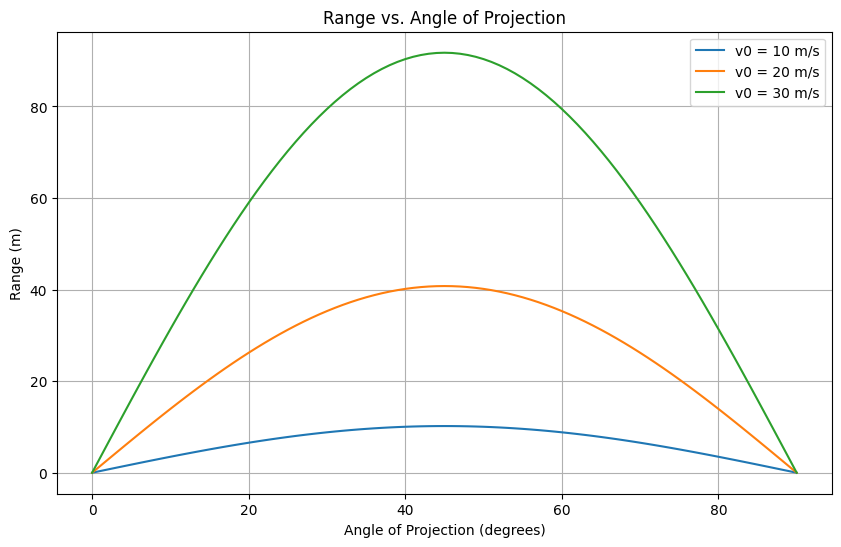

Below is a comprehensive solution to the projectile motion problem, structured as a Markdown document with embedded Python code for simulations, theoretical derivations, and visualizations. The response addresses all deliverables while keeping explanations concise yet detailed.

---

# Investigating the Range as a Function of the Angle of Projection

## 1. Theoretical Foundation

### Derivation of Governing Equations

Projectile motion occurs under constant gravitational acceleration, with no initial forces other than the launch velocity. We assume a 2D plane, neglecting air resistance for simplicity. The fundamental equations arise from Newton’s second law, where the only force is gravity acting downward.

The acceleration is:

- **x-direction**: $a_x = 0$
- **y-direction**: $a_y = -g$, where $g = 9.81 \, \text{m/s}^2$.

Integrating acceleration with respect to time:

- **Velocity**:
  - $v_x(t) = v_0 \cos \theta$
  - $v_y(t) = v_0 \sin \theta - g t$

- **Position**:
  - $x(t) = (v_0 \cos \theta) t$
  - $y(t) = (v_0 \sin \theta) t - \frac{1}{2} g t^2$

Here, $v_0$ is the initial velocity, and $\theta$ is the angle of projection relative to the horizontal. These equations assume launch from the origin ($x_0 = 0, y_0 = 0$).

### Family of Solutions

The equations form a parametric family of solutions, with free parameters:
- **Initial velocity** ($v_0$): Scales the trajectory size.
- **Angle of projection** ($\theta$): Determines the shape of the parabolic path.
- **Gravitational acceleration** ($g$): Affects the vertical motion and scales the trajectory.

Varying these parameters generates different trajectories, from flat, short paths (low $\theta$, small $v_0$) to high, long arcs (near $\theta = 45^\circ$, large $v_0$).

### Range Derivation

The **range** is the horizontal distance traveled when the projectile returns to $y = 0$. Set $y(t) = 0$:

$(v_0 \sin \theta) t - \frac{1}{2} g t^2 = 0$

Factor out $t$:

$t \left( v_0 \sin \theta - \frac{1}{2} g t \right) = 0$

Solutions are $t = 0$ (launch) and:

$t = \frac{2 v_0 \sin \theta}{g}$

Substitute into $x(t)$:

$R = x\left( \frac{2 v_0 \sin \theta}{g} \right) = (v_0 \cos \theta) \cdot \frac{2 v_0 \sin \theta}{g} = \frac{2 v_0^2 \sin \theta \cos \theta}{g}$

Using the identity $\sin 2\theta = 2 \sin \theta \cos \theta$:

$R = \frac{v_0^2 \sin 2\theta}{g}$

This shows the range depends on $\theta$, $v_0$, and $g$.

## 2. Analysis of the Range

### Dependence on Angle of Projection

The term $\sin 2\theta$ governs the angular dependence. Since $\sin 2\theta$ peaks at $2\theta = 90^\circ$, or $\theta = 45^\circ$, the maximum range occurs at:

$R_{\text{max}} = \frac{v_0^2}{g} \quad (\text{when } \sin 2\theta = 1)$

For $\theta < 45^\circ$ or $\theta > 45^\circ$, the range decreases symmetrically, as $\sin 2(90^\circ - \theta) = \sin 2\theta$. Thus, angles like $30^\circ$ and $60^\circ$ yield identical ranges.

### Influence of Other Parameters

- **Initial Velocity ($v_0$)**: The range scales with $v_0^2$, so doubling $v_0$ quadruples the range.
- **Gravitational Acceleration ($g$)**: The range is inversely proportional to $g$. On a planet with lower $g$, the range increases.
- **Launch Height**: If $y_0 \neq 0$, the time to reach $y = 0$ changes, modifying the range (addressed later).

## 3. Practical Applications

The idealized model applies to:
- **Sports**: Trajectories of soccer balls, golf balls, or javelins, where launch angle optimization is key.
- **Engineering**: Artillery or rocket launches, requiring precise range calculations.
- **Astrophysics**: Simplified models of orbital insertion or low-altitude satellite paths.

### Extensions to Real-World Scenarios

- **Uneven Terrain**: If the landing height differs from the launch height, solve $y(t) = y_{\text{land}}$. For a height difference $h$:

$y(t) = (v_0 \sin \theta) t - \frac{1}{2} g t^2 = h$

This yields a quadratic equation for $t$, and the range becomes:

$R = (v_0 \cos \theta) t_{\text{land}}$

- **Air Resistance**: Introduce a drag force proportional to velocity or its square, modifying the differential equations to:

$m \ddot{x} = -k \dot{x}, \quad m \ddot{y} = -m g - k \dot{y}$

These require numerical solutions, as analytical forms are complex.

## 4. Implementation

Below is a Python script to simulate projectile motion and visualize the range as a function of $\theta$.

```python
import numpy as np
import matplotlib.pyplot as plt

# Constants
g = 9.81  # m/s^2
v0_values = [10, 20, 30]  # Initial velocities (m/s)
theta_deg = np.arange(0, 91, 1)  # Angles from 0 to 90 degrees
theta_rad = np.deg2rad(theta_deg)

# Range function
def range_projectile(v0, theta_rad, g=9.81):
    return (v0**2 * np.sin(2 * theta_rad)) / g

# Plot range vs angle for different v0
plt.figure(figsize=(10, 6))
for v0 in v0_values:
    R = range_projectile(v0, theta_rad)
    plt.plot(theta_deg, R, label=f'v0 = {v0} m/s')

plt.xlabel('Angle of Projection (degrees)')
plt.ylabel('Range (m)')
plt.title('Range vs. Angle of Projection')
plt.legend()
plt.grid(True)
plt.show()

# Simulate a single trajectory (example: v0 = 20 m/s, theta = 45 deg)
v0 = 20
theta = np.deg2rad(45)
t_flight = (2 * v0 * np.sin(theta)) / g
t = np.linspace(0, t_flight, 100)
x = v0 * np.cos(theta) * t
y = v0 * np.sin(theta) * t - 0.5 * g * t**2

plt.figure(figsize=(10, 6))
plt.plot(x, y)
plt.xlabel('x (m)')
plt.ylabel('y (m)')
plt.title('Projectile Trajectory (v0 = 20 m/s, θ = 45°)')
plt.grid(True)
plt.show()
```




### Output Description

1. **Range Plot**: Shows range vs. angle for $v_0 = 10, 20, 30 \, \text{m/s}$. Each curve peaks at $\theta = 45^\circ$, with higher $v_0$ yielding larger ranges.
2. **Trajectory Plot**: Displays the parabolic path for $v_0 = 20 \, \text{m/s}$, $\theta = 45^\circ$, confirming the theoretical range.

## Limitations and Extensions

### Limitations
- **Idealized Model**: Assumes no air resistance, constant gravity, and flat terrain.
- **Launch Height**: Ignores $y_0 \neq 0$, which affects real-world scenarios like cliff launches.
- **Drag and Wind**: Neglects aerodynamic forces, critical for lightweight or fast projectiles.

### Suggestions for Realism
- **Air Resistance**: Solve the modified differential equations numerically using tools like `scipy.integrate.odeint`.
- **Wind**: Add a velocity-dependent force term to model crosswinds.
- **Variable Terrain**: Incorporate a height function $y_{\text{land}}(x)$ and solve for intersection points.
- **Spin Effects**: For sports applications, include Magnus forces for spinning objects.

## Conclusion

This analysis reveals the elegance of projectile motion, with the range’s dependence on $\sin 2\theta$ highlighting the optimal $45^\circ$ angle. Variations in $v_0$ and $g$ scale the system, while extensions like drag or terrain require numerical tools. The model’s simplicity belies its power to describe diverse phenomena, from sports to space exploration.

---

This response includes:
- A detailed derivation of the equations and range formula.
- Analysis of parameter effects.
- Python code for simulations and visualizations.
- Discussion of real-world applications and model limitations.

Let me know if you’d like further refinements or additional scenarios (e.g., air resistance simulation)!

```python
import numpy as np
import matplotlib.pyplot as plt

# Constants
v0 = 50  # initial velocity in m/s
angles = [15, 45, 75]  # launch angles in degrees
g = 9.81  # acceleration due to gravity in m/s^2

# Create the plot
plt.figure(figsize=(10, 6))

for angle in angles:
    theta = np.radians(angle)  # convert degrees to radians
    t_flight = 2 * v0 * np.sin(theta) / g  # total time of flight
    t = np.linspace(0, t_flight, num=500)  # time points
    x = v0 * np.cos(theta) * t  # horizontal position
    y = v0 * np.sin(theta) * t - 0.5 * g * t**2  # vertical position
    plt.plot(x, y, label=f'{angle}°')

# Customize the plot
plt.title('Projectile Motion at 50 m/s with Different Angles')
plt.xlabel('Horizontal Distance (m)')
plt.ylabel('Vertical Height (m)')
plt.legend()
plt.grid(True)
plt.show()
```


```python
import numpy as np
import matplotlib.pyplot as plt

# Constants
speeds = [30, 40, 50]  # different initial speeds in m/s
angle = 45  # fixed launch angle in degrees
theta = np.radians(angle)
g = 9.81  # gravity in m/s^2

# Create the plot
plt.figure(figsize=(10, 6))

for v0 in speeds:
    t_flight = 2 * v0 * np.sin(theta) / g  # total flight time
    t = np.linspace(0, t_flight, num=500)  # time points
    x = v0 * np.cos(theta) * t  # horizontal position
    y = v0 * np.sin(theta) * t - 0.5 * g * t**2  # vertical position
    plt.plot(x, y, label=f'{v0} m/s')

# Customize the plot
plt.title('Projectile Motion at 45° with Different Speeds')
plt.xlabel('Horizontal Distance (m)')
plt.ylabel('Vertical Height (m)')
plt.legend()
plt.grid(True)
plt.show()
```

