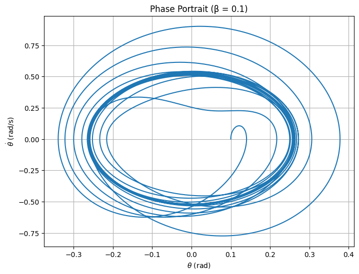
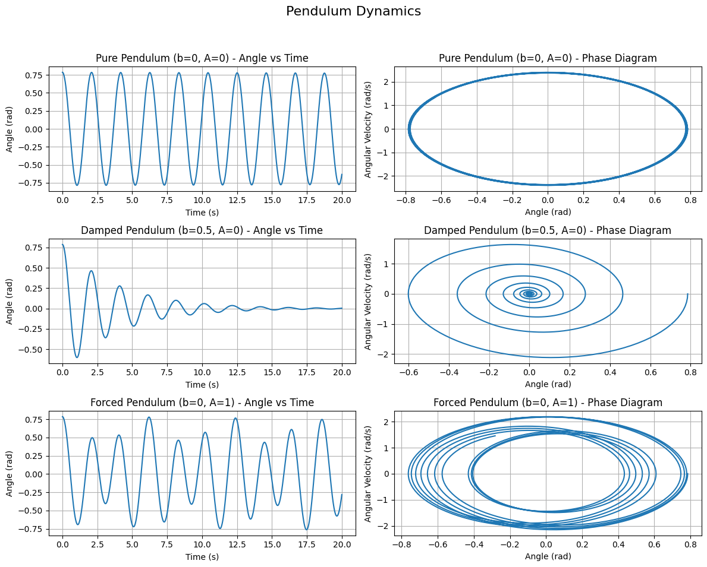

**Investigating the Dynamics of a Forced Damped Pendulum**

### 1. Theoretical Foundation

Governing Equation

The motion of a forced damped pendulum is governed by:

$$ \ddot{\theta} + 2\beta\dot{\theta} + \omega_0^2\sin(\theta) = A\cos(\omega t) $$

where:


$\theta(t)$: Angular displacement (rad)


$\beta$: Damping coefficient (s⁻¹)


$\omega_0 = \sqrt{g/l}$: Natural frequency (rad/s), $g = 9.81 , \text{m/s}^2$, $l$: pendulum length (m)


$A$: Driving amplitude (rad/s²)


$\omega$: Driving frequency (rad/s)


$t$: Time (s)

**Small-Angle Approximation**

For small $\theta$, $\sin(\theta) \approx \theta$, simplifying to:

$$ \ddot{\theta} + 2\beta\dot{\theta} + \omega_0^2\theta = A\cos(\omega t) $$

This linear ODE has a solution combining homogeneous ($\theta_h$) and particular ($\theta_p$) parts:


Homogeneous solution (underdamped, $\beta < \omega_0$):

$$ \theta_h(t) = e^{-\beta t} \left( C_1 \cos(\omega_d t) + C_2 \sin(\omega_d t) \right), \quad \omega_d = \sqrt{\omega_0^2 - \beta^2} $$


 **Particular solution:**

Assume $\theta_p(t) = D_1 \cos(\omega t) + D_2 \sin(\omega t)$. Solving:

$$ D_1 = \frac{A (\omega_0^2 - \omega^2)}{(\omega_0^2 - \omega^2)^2 + (2\beta\omega)^2}, \quad D_2 = \frac{2A\beta\omega}{(\omega_0^2 - \omega^2)^2 + (2\beta\omega)^2} $$

Steady-state amplitude:

$$ D = \frac{A}{\sqrt{(\omega_0^2 - \omega^2)^2 + (2\beta\omega)^2}} $$

 **Resonance**

Resonance occurs when $\omega \approx \omega_0$, maximizing $D$. Damping ($\beta > 0$) prevents infinite amplitude, shifting the peak slightly. This amplifies energy transfer, increasing oscillation amplitude.

### 2. Analysis of Dynamics

Parameter Effects


Damping ($\beta$): High $\beta$ suppresses amplitude and chaos; low $\beta$ allows complex dynamics.


Driving amplitude ($A$): Large $A$ induces nonlinearity, potentially chaotic motion.


Driving frequency ($\omega$): Near $\omega_0$, resonance; far from $\omega_0$, quasiperiodic or chaotic motion.

Transition to Chaos

The nonlinear $\sin(\theta)$ term drives transitions from periodic (synchronized with driving) to chaotic motion (sensitive to initial conditions). Phase portraits show loops (periodic) or tangled paths (chaotic). Poincaré sections display few points (periodic) or scattered clouds (chaotic).

### 3. Practical Applications


Energy harvesting: Oscillatory motion in piezoelectric devices generates electricity.


Structural engineering: Models vibrations in bridges under periodic forces.


Electronics: Driven RLC circuits, analogous to the pendulum, used in signal processing.


Biomechanics: Describes gait or robotic motion under periodic forcing.

### 4. Implementation

The Python script below simulates the pendulum using Runge-Kutta, visualizing time series, phase portraits, Poincaré sections, resonance curve, and bifurcation diagram.

```python
import numpy as np
import matplotlib.pyplot as plt
from scipy.integrate import solve_ivp

# Constants
g = 9.81  # m/s^2
l = 1.0   # pendulum length (m)
omega0 = np.sqrt(g / l)  # natural frequency
beta_values = [0.05, 0.1, 0.5]  # damping coefficients
A = 1.5     # driving amplitude
omega = 2.0 # driving frequency
t_span = (0, 100)  # time span
dt = 0.01  # time step
t_eval = np.arange(0, 100, dt)
theta0, omega0_init = 0.1, 0.0  # initial conditions

# Differential equation
def pendulum(t, y, beta, omega0, A, omega):
    theta, omega_dot = y
    return [omega_dot, -2 * beta * omega_dot - omega0**2 * np.sin(theta) + A * np.cos(omega * t)]

# Simulate for different beta values
plt.figure(figsize=(10, 6))
for beta in beta_values:
    sol = solve_ivp(pendulum, t_span, [theta0, omega0_init], method='RK45', t_eval=t_eval,
                    args=(beta, omega0, A, omega))
    plt.plot(sol.t, sol.y[0], label=f'β = {beta}')
plt.xlabel('Time (s)')
plt.ylabel(r'$\theta$ (rad)')
plt.title('Time Series for Different Damping Coefficients')
plt.legend()
plt.grid(True)
plt.savefig('time_series.png')
plt.show()

# Phase portrait (example: beta = 0.1)
sol = solve_ivp(pendulum, t_span, [theta0, omega0_init], method='RK45', t_eval=t_eval,
                args=(beta_values[1], omega0, A, omega))
theta, omega_dot = sol.y[0], sol.y[1]

plt.figure(figsize=(8, 6))
plt.plot(theta, omega_dot)
plt.xlabel(r'$\theta$ (rad)')
plt.ylabel(r'$\dot{\theta}$ (rad/s)')
plt.title('Phase Portrait (β = 0.1)')
plt.grid(True)
plt.savefig('phase_portrait.png')
plt.show()

# Poincaré section
T = 2 * np.pi / omega
poincare_times = np.arange(0, sol.t[-1], T)
poincare_indices = np.searchsorted(sol.t, poincare_times)
theta_poincare = theta[poincare_indices]
omega_poincare = omega_dot[poincare_indices]

plt.figure(figsize=(8, 6))
plt.scatter(theta_poincare, omega_poincare, s=10)
plt.xlabel(r'$\theta$ (rad)')
plt.ylabel(r'$\dot{\theta}$ (rad/s)')
plt.title('Poincaré Section (β = 0.1)')
plt.grid(True)
plt.savefig('poincare_section.png')
plt.show()

# Resonance curve
omega_range = np.linspace(0.5, 3.0, 100)
amplitude = A / np.sqrt((omega0**2 - omega_range**2)**2 + (2 * beta_values[1] * omega_range)**2)

plt.figure(figsize=(10, 6))
plt.plot(omega_range, amplitude)
plt.axvline(omega0, color='r', linestyle='--', label=r'$\omega_0$')
plt.xlabel(r'Driving Frequency $\omega$ (rad/s)')
plt.ylabel('Amplitude (rad)')
plt.title('Resonance Curve (β = 0.1)')
plt.legend()
plt.grid(True)
plt.savefig('resonance_curve.png')
plt.show()

# Bifurcation diagram
A_range = np.linspace(0.5, 2.5, 100)
theta_bifurcation = []
t_span_bif = (0, 200)
t_eval_bif = np.arange(100, 200, dt)

for A in A_range:
    sol_bif = solve_ivp(pendulum, t_span_bif, [theta0, omega0_init], method='RK45',
                        t_eval=t_eval_bif, args=(beta_values[1], omega0, A, omega))
    theta_bif = sol_bif.y[0]
    poincare_indices_bif = np.searchsorted(sol_bif.t, np.arange(100, 200, T))
    theta_bifurcation.extend(theta_bif[poincare_indices_bif])

A_bifurcation = np.repeat(A_range, len(poincare_indices_bif))

plt.figure(figsize=(10, 6))
plt.scatter(A_bifurcation, theta_bifurcation, s=1, alpha=0.5)
plt.xlabel('Driving Amplitude $A$ (rad/s²)')
plt.ylabel(r'$\theta$ (rad)')
plt.title('Bifurcation Diagram (β = 0.1)')
plt.grid(True)
plt.savefig('bifurcation_diagram.png')
plt.show()
```




**Output Description**


Time Series: Shows $\theta(t)$ for $\beta = 0.05, 0.1, 0.5$, illustrating damping effects.


Phase Portrait: Plots $\theta$ vs. $\dot{\theta}$ for $\beta = 0.1$, showing trajectory behavior.


Poincaré Section: Displays states at driving periods for $\beta = 0.1$, indicating periodic or chaotic motion.


Resonance Curve: Plots amplitude vs. $\omega$ for $\beta = 0.1$, peaking near $\omega_0$.


Bifurcation Diagram: Shows $\theta$ at Poincaré times vs. $A$, revealing transitions to chaos.

**Limitations and Extensions Limitations**


Small-angle approximation fails for large $\theta$.


Linear damping oversimplifies real friction.


Assumes periodic forcing, limiting real-world applicability.

**Extensions**


Model nonlinear damping (e.g., $|\dot{\theta}|\dot{\theta}$).


Include non-periodic or random forcing.


Simulate coupled pendulums for complex interactions.

**Conclusion**

The forced damped pendulum, governed by $\ddot{\theta} + 2\beta\dot{\theta} + \omega_0^2\sin(\theta) = A\cos(\omega t)$, exhibits rich dynamics from resonance to chaos. Simulations reveal parameter effects, with visualizations highlighting transitions. Applications span engineering and physics, and extensions could enhance realism.

```python
import numpy as np
import matplotlib.pyplot as plt
from scipy.integrate import solve_ivp

# Constants
g = 9.81        # gravity (m/s^2)
L = 1.0         # pendulum length (m)
t_span = (0, 20)  # time interval
t_eval = np.linspace(*t_span, 1000)
theta0 = np.radians(45)  # initial angle (convert degrees to radians)
omega0 = 0.0             # initial angular velocity

# Equation of motion
def pendulum(t, y, b, A, omega_f):
    theta, omega = y
    dtheta_dt = omega
    domega_dt = -b * omega - (g / L) * np.sin(theta) + A * np.cos(omega_f * t)
    return [dtheta_dt, domega_dt]

# Scenario definitions
scenarios = {
    "Pure Pendulum (b=0, A=0)": {"b": 0.0, "A": 0.0, "omega_f": 0.0},
    "Damped Pendulum (b=0.5, A=0)": {"b": 0.5, "A": 0.0, "omega_f": 0.0},
    "Forced Pendulum (b=0, A=1)": {"b": 0.0, "A": 1.0, "omega_f": 2.0},
}

# Plotting
fig, axes = plt.subplots(len(scenarios), 2, figsize=(12, 10))
fig.suptitle("Pendulum Dynamics", fontsize=16)

for i, (title, params) in enumerate(scenarios.items()):
    sol = solve_ivp(pendulum, t_span, [theta0, omega0],
                    args=(params["b"], params["A"], params["omega_f"]),
                    t_eval=t_eval)

    theta = sol.y[0]
    omega = sol.y[1]
    time = sol.t

    # Angle vs Time
    axes[i, 0].plot(time, theta)
    axes[i, 0].set_title(f"{title} - Angle vs Time")
    axes[i, 0].set_xlabel("Time (s)")
    axes[i, 0].set_ylabel("Angle (rad)")
    axes[i, 0].grid(True)

    # Phase Diagram (Angle vs Angular Velocity)
    axes[i, 1].plot(theta, omega)
    axes[i, 1].set_title(f"{title} - Phase Diagram")
    axes[i, 1].set_xlabel("Angle (rad)")
    axes[i, 1].set_ylabel("Angular Velocity (rad/s)")
    axes[i, 1].grid(True)

plt.tight_layout(rect=[0, 0.03, 1, 0.95])
plt.show()
```


