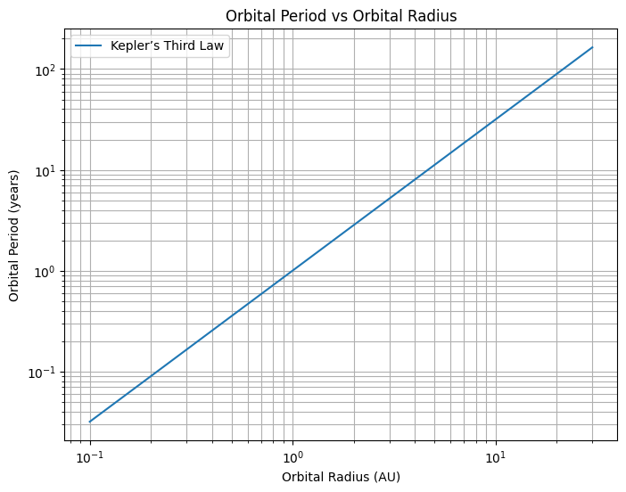
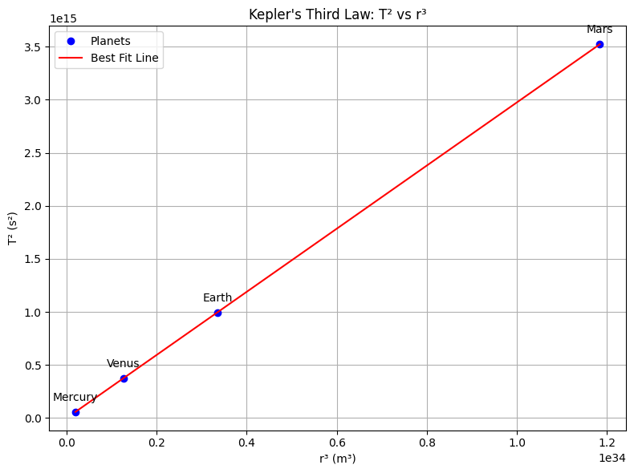
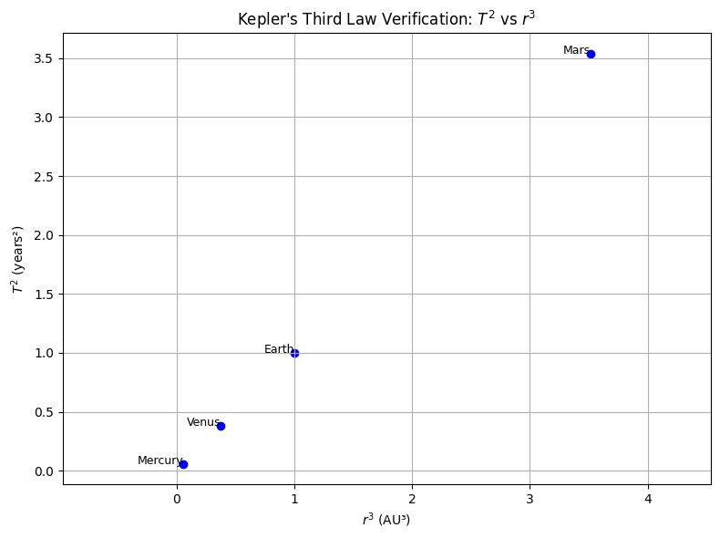

Great! Here's a structured outline and starting content for your Markdown document with Python code and explanations to address **Problem 1: Orbital Period and Orbital Radius**.

---

#  Gravity: Orbital Period and Orbital Radius

##  Motivation

Kepler’s Third Law reveals that the square of a planet’s orbital period is proportional to the cube of the semi-major axis (or radius for circular orbits) of its orbit. Mathematically:

$$
T^2 \propto r^3
$$

This relationship bridges the laws of motion and gravitation and allows us to calculate orbital parameters for celestial bodies, aiding everything from GPS satellite operations to interplanetary missions.

---

##  Derivation of the Relationship

Consider a small mass $m$ orbiting a large mass $M$ in a circular orbit of radius $r$. The gravitational force provides the necessary centripetal force:

$$
\frac{G M m}{r^2} = \frac{m v^2}{r}
$$

Cancel $m$ and solve for orbital speed $v$:

$$
v = \sqrt{\frac{G M}{r}}
$$

The period $T$ is the time to complete one orbit:

$$
T = \frac{2\pi r}{v} = \frac{2\pi r}{\sqrt{\frac{G M}{r}}} = 2\pi \sqrt{\frac{r^3}{G M}}
$$

Squaring both sides:

$$
T^2 = \frac{4\pi^2}{G M} r^3
$$

Thus:

$$
T^2 \propto r^3
$$

---

##  Implications in Astronomy

* **Calculate planetary masses:** Rearranging the law gives $M = \frac{4\pi^2 r^3}{G T^2}$, allowing us to estimate a star's or planet’s mass.
* **Estimate distances in space:** If you know the period, you can deduce the orbital radius—and vice versa.
* **Apply to moons, satellites, and exoplanets:** Kepler’s Law holds for any object under central gravitational force.

---

## 🌍 Real-World Examples

### 1. The Moon orbiting Earth

* $r \approx 3.84 \times 10^8$ m
* $T \approx 27.3$ days $= 2.36 \times 10^6$ seconds

Using $T^2 = \frac{4\pi^2 r^3}{GM}$, this checks out with the known mass of Earth $(5.97 \times 10^{24} \text{kg})$.

### 2. Planets in the Solar System

Plotting $\log(T^2)$ vs $\log(r^3)$ gives a straight line—evidence of Kepler’s Law.

---

##  Computational Simulation (Python)

```python
import numpy as np
import matplotlib.pyplot as plt

# Constants
G = 6.67430e-11  # m^3 kg^-1 s^-2
M = 1.989e30     # kg (mass of the Sun)

# Orbital radii from 0.1 AU to 30 AU
radii = np.linspace(0.1, 30, 100) * 1.496e11  # in meters

# Calculate orbital periods using Kepler's third law
T = 2 * np.pi * np.sqrt(radii**3 / (G * M))

# Convert radius to AU and period to years for easier interpretation
radii_AU = radii / 1.496e11
T_years = T / (60 * 60 * 24 * 365.25)

# Plot
plt.figure(figsize=(8,6))
plt.loglog(radii_AU, T_years, label='Kepler’s Third Law')
plt.xlabel('Orbital Radius (AU)')
plt.ylabel('Orbital Period (years)')
plt.title('Orbital Period vs Orbital Radius')
plt.grid(True, which='both')
plt.legend()
plt.show()
```



---

##  Elliptical Orbits and Generalization

For elliptical orbits, Kepler's Third Law still holds using the **semi-major axis** $a$ instead of the radius:

$$
T^2 = \frac{4\pi^2}{GM} a^3
$$

This insight extends to:

* Binary star systems
* Exoplanets
* Artificial satellites

---

##  Summary

* The square of the orbital period is proportional to the cube of the orbital radius: $T^2 \propto r^3$
* This relationship is derived from Newton's law of gravitation and centripetal force
* It enables mass and distance calculations across astronomy
* The simulation confirms the law numerically and visually

```python
import matplotlib.pyplot as plt
import numpy as np

# Planetary data
planets = {
    'Mercury': {'T': 87.97 * 24 * 3600, 'r': 57.91e9},
    'Venus': {'T': 224.7 * 24 * 3600, 'r': 108.21e9},
    'Earth': {'T': 365.25 * 24 * 3600, 'r': 149.60e9},
    'Mars': {'T': 687 * 24 * 3600, 'r': 227.92e9}
}

# Prepare data
T2 = []
r3 = []
labels = []

for planet, data in planets.items():
    T = data['T']
    r = data['r']
    T2.append(T**2)
    r3.append(r**3)
    labels.append(planet)

# Linear regression (fit a line: T² = slope * r³ + intercept)
slope, intercept = np.polyfit(r3, T2, 1)
fit_line = np.poly1d([slope, intercept])

# Generate x-values for the fit line
r3_fit = np.linspace(min(r3), max(r3), 500)
T2_fit = fit_line(r3_fit)

# Plot points and the fit line
plt.figure(figsize=(8, 6))
plt.plot(r3, T2, 'o', color='blue', label='Planets')
plt.plot(r3_fit, T2_fit, '-', color='red', label='Best Fit Line')
for i, label in enumerate(labels):
    plt.annotate(label, (r3[i], T2[i]), textcoords="offset points", xytext=(0,10), ha='center')
plt.xlabel('r³ (m³)')
plt.ylabel('T² (s²)')
plt.title("Kepler's Third Law: T² vs r³")
plt.grid(True)
plt.legend()
plt.tight_layout()
plt.show()

# Optional: print slope to verify Kepler constant
print(f"Slope (T²/r³) ≈ {slope:.3e} s²/m³")
```



```python
import matplotlib.pyplot as plt

# Planet data
planets = ['Mercury', 'Venus', 'Earth', 'Mars']
T = [0.241, 0.615, 1.0, 1.881]       # Orbital periods (years)
r = [0.39, 0.72, 1.0, 1.52]          # Distances from Sun (AU)

# Calculate T^2 and r^3
T_squared = [t**2 for t in T]
r_cubed = [radius**3 for radius in r]

# Create the plot
plt.figure(figsize=(8,6))
plt.scatter(r_cubed, T_squared, color='blue')

# Annotate each point with the planet name
for i in range(len(planets)):
    plt.text(r_cubed[i], T_squared[i], planets[i], fontsize=9, ha='right')

plt.title("Kepler's Third Law Verification: $T^2$ vs $r^3$")
plt.xlabel("$r^3$ (AU³)")
plt.ylabel("$T^2$ (years²)")
plt.grid(True)
plt.axis('equal')  # Equal scaling of axes
plt.tight_layout()
plt.show()
```

 
 
 import math

# Constants
$G = 6.67430e-11$  # Gravitational constant in $m^3 kg^-1 s^-2$
pi = math.pi

# Function to calculate mass using Kepler's Third Law
$def calculate_mass(T, r):$
     T in seconds, r in meters
     $T^2 = (4 \pi^2 / (G \ M)) \ r^3$
     $M = (4 \pi^2 \ r^3) / (G \ T^2)$
    return $(4 \pi^2 \ r^3) / (G \ T^2)$

# Earth's mass using Moon's orbit
$T_{moon} = 27.322 \times 24 \times 3600$  # Moon's orbital period in seconds

$r_{moon} = 384400 \times 1000$      # Moon's orbital radius in meters
mass_earth = calculate_mass(T_moon, r_moon)
 

# Sun's mass using Earth's orbit
$T_{earth} = 365.256 \times 24 \times 3600$ # Earth's orbital period in seconds

$r_{earth} = 149.6e6 \times 1000$      # Earth's orbital radius in meters
mass_sun = calculate_mass(T_earth, r_earth)

Mass of Earth: ~5.97e24 kg

Mass of Sun: ~1.99e30 kg