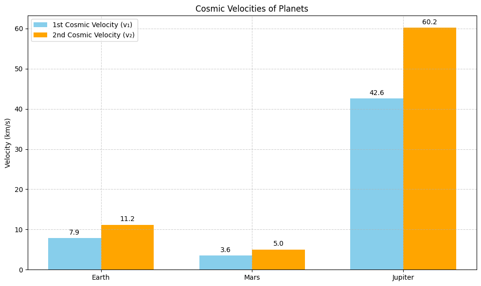
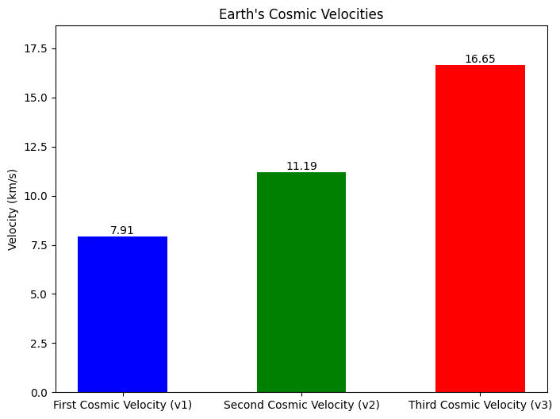

# Problem 2 
 Escape Velocities and Cosmic Velocities
 Definitions and Physical Meaning
First Cosmic Velocity (Orbital Velocity):

Definition: The minimum velocity needed for a body to enter a stable circular orbit just above the surface of a celestial body.

Physical Meaning: It's the speed at which an object must travel horizontally so that its centrifugal force balances gravitational pull.

Formula:

$$
𝑣1=\sqrt{\frac{𝐺𝑀}{R}}
$$ 
​
 
where:

• **G** is the gravitational constant,

• **M** is the mass of the celestial body,

• **R**  is the radius from the center of the body to the orbit.

### Second Cosmic Velocity (Escape Velocity):

Definition: The minimum speed needed to break free from a celestial body's gravitational field without further propulsion.

Physical Meaning: Allows a spacecraft to escape into space without falling back.

Formula:

$$
𝑣2=\sqrt{\frac{2𝐺𝑀}{R}}= \sqrt2 v 1
$$


### Third Cosmic Velocity (Solar System Escape Velocity):

Definition: The minimum speed required to escape the gravitational influence of the Sun from Earth's orbit.

Physical Meaning: It allows a spacecraft to leave the solar system.

Formula (from Earth’s orbit):

$$
𝑣3=\sqrt{𝑣_{orbital sun}2+𝑣2^2} 
​$$
 
where $v_{orbital sun}≈29.78km/s$ is Earth’s orbital speed around the Sun.

## Mathematical Derivation Overview
The basic concept relies on conservation of mechanical energy (kinetic + potential):


• **Total energy** $E =\frac{1}{2} m v^2 -\frac{G M m}{R}$


• **For escape**    $𝐸≥0$  → solve for 𝑣


For orbital motion, balance centripetal and gravitational forces:

$$
\frac{𝑚𝑣^2}{𝑅}=\frac{𝐺𝑀𝑚}{𝑅^2}⇒𝑣=\sqrt{\frac{𝐺𝑀}{R}}
​$$
 
​
 
##  Velocities for Earth, Mars, and Jupiter

```python
import numpy as np
import matplotlib.pyplot as plt

# Universal gravitational constant (m^3 kg^-1 s^-2)
G = 6.67430e-11

# Planet data: (name, mass [kg], radius [m])
planets = {
    "Earth": (5.972e24, 6.371e6),
    "Mars": (6.417e23, 3.389e6),
    "Jupiter": (1.898e27, 6.991e7),
}

# Compute velocities
first_cosmic = {}
second_cosmic = {}

for planet, (mass, radius) in planets.items():
    v1 = np.sqrt(G * mass / radius)         # First cosmic velocity (orbital)
    v2 = np.sqrt(2 * G * mass / radius)     # Second cosmic velocity (escape)
    first_cosmic[planet] = v1 / 1000        # Convert to km/s
    second_cosmic[planet] = v2 / 1000

# Visualization
labels = list(planets.keys())
v1_values = [first_cosmic[p] for p in labels]
v2_values = [second_cosmic[p] for p in labels]

x = np.arange(len(labels))
width = 0.35

fig, ax = plt.subplots(figsize=(10, 6))
bars1 = ax.bar(x - width/2, v1_values, width, label='1st Cosmic Velocity (v₁)', color='skyblue')
bars2 = ax.bar(x + width/2, v2_values, width, label='2nd Cosmic Velocity (v₂)', color='orange')

ax.set_ylabel('Velocity (km/s)')
ax.set_title('Cosmic Velocities of Planets')
ax.set_xticks(x)
ax.set_xticklabels(labels)
ax.legend()
ax.grid(True, linestyle='--', alpha=0.6)

# Add value labels on top of the bars
for bar in bars1 + bars2:
    height = bar.get_height()
    ax.annotate(f'{height:.1f}',
                xy=(bar.get_x() + bar.get_width() / 2, height),
                xytext=(0, 3), textcoords="offset points",
                ha='center', va='bottom')

plt.tight_layout()
plt.show()
```




## Importance in Space Exploration
**Launching Satellites:**

• Satellites are placed in orbit using the first cosmic velocity.

• Geostationary, polar, and LEO satellites require precise velocity control.

**Interplanetary Missions:**

• Second cosmic velocity allows probes (like Voyager, New Horizons) to escape Earth.

• Gravity assists and orbital slingshots optimize fuel use for Mars, Jupiter missions.

**Interstellar Travel:**

• Third cosmic velocity (and more) is necessary for leaving the solar system.

• Technologies like ion drives and solar sails aim to reduce fuel constraints.

```python
import numpy as np
import matplotlib.pyplot as plt

# Constants
G = 6.67430e-11  # Gravitational constant (m^3 kg^-1 s^-2)
M_earth = 5.972e24  # Mass of Earth (kg)
R_earth = 6.371e6  # Radius of Earth (m)
M_sun = 1.989e30  # Mass of the Sun (kg)
AU = 149.6e9  # 1 AU in meters

# First cosmic velocity (v1) - Circular orbit velocity
v1 = np.sqrt(G * M_earth / R_earth) / 1000  # Convert to km/s

# Second cosmic velocity (v2) - Escape velocity
v2 = np.sqrt(2 * G * M_earth / R_earth) / 1000  # Convert to km/s

# Third cosmic velocity (v3) - Escape from Sun's gravity
# Earth's orbital velocity around the Sun
v_orbit = np.sqrt(G * M_sun / (AU)) / 1000  # km/s
# Escape velocity from Sun at 1 AU
v_esc_sun = np.sqrt(2 * G * M_sun / (AU)) / 1000  # km/s
# Additional velocity needed to escape Sun
delta_v = v_esc_sun - v_orbit
# Total v3 (combine v2 and delta_v)
v3 = np.sqrt(v2**2 + delta_v**2)

# Data for plotting
velocities = [v1, v2, v3]
labels = ["First Cosmic Velocity (v1)", "Second Cosmic Velocity (v2)", "Third Cosmic Velocity (v3)"]

# Create bar chart
fig, ax = plt.subplots(figsize=(8, 6))
bars = ax.bar(labels, velocities, color=["blue", "green", "red"], width=0.5)

# Add value labels on top of bars
for bar in bars:
    height = bar.get_height()
    ax.text(bar.get_x() + bar.get_width()/2, height, f"{height:.2f}", ha="center", va="bottom")

# Customize the plot
ax.set_ylabel("Velocity (km/s)")
ax.set_title("Earth's Cosmic Velocities")
ax.set_ylim(0, max(velocities) + 2)  # Adjust y-axis limit for better visibility

# Save the plot
plt.savefig("earth_cosmic_velocities.png")
```

