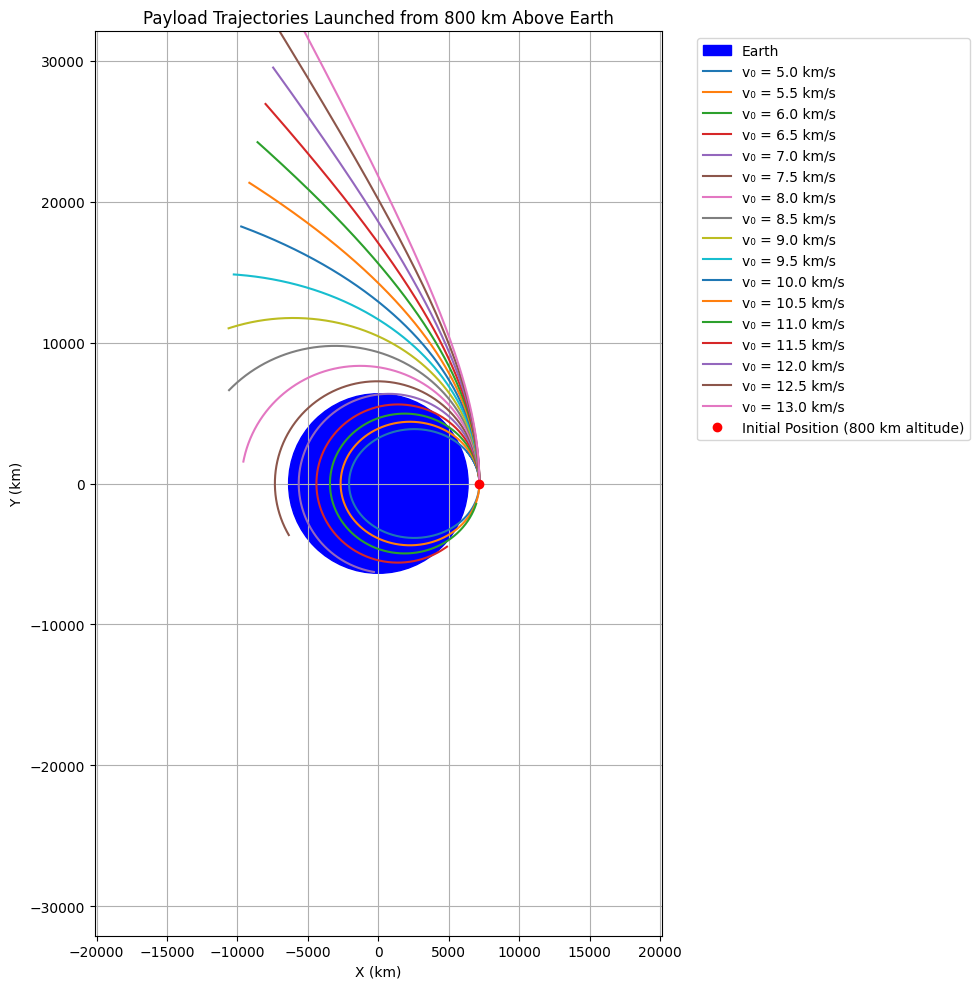

# Problem 3
# Trajectories of a Freely Released Payload Near Earth

## Motivation

When a payload is released from a spacecraft or rocket near Earth, the trajectory it follows depends on its velocity and position at release. Whether it falls back to Earth, enters orbit, or escapes Earth's gravity depends on fundamental physical principles governed by Newtonian mechanics.

### Physical Principles
# Newton's Law of Universal Gravitation:

$$
𝐹=\frac{𝐺𝑀𝑚}{𝑟^2}
$$


 
Where:


**F**: gravitational force

**G**: gravitational constant 
$6.67430 \times 10^{-11} \, \text{m}^3 \text{kg}^{-1} \text{s}^{-2}$


**M**: mass of Earth


**m**: mass of payload


**r**: distance from Earth's center

## Orbital Mechanics (Specific Mechanical Energy):
$$
𝜖=\frac{𝑣^2}{2}−\frac{GM}{r}
$$


• ϵ<0: elliptical orbit (bound)

• ϵ=0: parabolic trajectory (escape)

• ϵ>0: hyperbolic trajectory (escape at high speed)

## Python Simulation
Let’s simulate the motion using a numerical integrator (Euler or Runge-Kutta 4).

**Assumptions:**

•2D motion in a plane

•Only gravity from Earth

•Earth's radius: 6,371 km

•No atmospheric drag

```python
import numpy as np
import matplotlib.pyplot as plt

# Constants
G = 6.67430e-11           # gravitational constant (m^3 kg^-1 s^-2)
M = 5.972e24              # mass of Earth (kg)
R_earth = 6.371e6         # radius of Earth (m)

# Simulation parameters
dt = 1                    # time step (s)
t_max = 10000             # max simulation time (s)

# Initial conditions
altitude = 300e3          # 300 km above Earth's surface
r0 = R_earth + altitude   # initial distance from Earth's center (m)
v0 = 7500                 # initial velocity (m/s) - try 0 to 11000 m/s
theta = np.deg2rad(90)    # launch angle from local horizontal (0 = tangential)

# Convert to Cartesian coordinates
pos = np.array([r0, 0])
vel = np.array([v0 * np.cos(theta), v0 * np.sin(theta)])

# Trajectory storage
positions = [pos.copy()]

# Numerical integration (RK4)
def acceleration(pos):
    r = np.linalg.norm(pos)
    return -G * M * pos / r**3

for _ in range(t_max):
    # Break if payload hits Earth
    if np.linalg.norm(pos) <= R_earth:
        break

    # RK4 integration
    k1v = acceleration(pos) * dt
    k1x = vel * dt

    k2v = acceleration(pos + 0.5 * k1x) * dt
    k2x = (vel + 0.5 * k1v) * dt

    k3v = acceleration(pos + 0.5 * k2x) * dt
    k3x = (vel + 0.5 * k2v) * dt

    k4v = acceleration(pos + k3x) * dt
    k4x = (vel + k3v) * dt

    vel += (k1v + 2*k2v + 2*k3v + k4v) / 6
    pos += (k1x + 2*k2x + 2*k3x + k4x) / 6

    positions.append(pos.copy())

positions = np.array(positions)

# Plot the trajectory
fig, ax = plt.subplots(figsize=(8, 8))
earth = plt.Circle((0, 0), R_earth, color='blue', alpha=0.5, label='Earth')
ax.add_artist(earth)
ax.plot(positions[:, 0], positions[:, 1], color='red', label='Payload Trajectory')
ax.set_xlabel('X Position (m)')
ax.set_ylabel('Y Position (m)')
ax.set_title('Payload Trajectory Near Earth')
ax.set_aspect('equal')
plt.legend()
plt.grid()
plt.show()
```


## Trajectory Analysis

Based on the specific mechanical energy, we classify trajectories:

• **Elliptical Orbit:** 
ϵ<0, occurs at orbital speeds (e.g., 7.5 km/s at 300 km)

• **Parabolic Escape:** 
ϵ=0, escape velocity at that altitude

• **Hyperbolic Escape:** 
ϵ>0, if released with > escape speed

• **Sub-orbital Trajectory**: Lower than orbital speed, payload reenters

## Applications in Mission Design

| Condition                       | Scenario                               |
| ------------------------------- | -------------------------------------- |
| Low velocity (e.g., < 7.5 km/s) | Reentry or suborbital flight           |
| Orbital velocity (≈ 7.8 km/s)   | Stable low Earth orbit                 |
| Escape velocity (≈ 11.2 km/s)   | Leaving Earth's gravity (to Moon/Mars) |
| Direction control               | Insertion into specific orbits         |

```python
import numpy as np
import matplotlib.pyplot as plt
from scipy.integrate import odeint

# Constants (in SI units, converted to km where needed)
G = 6.67430e-11  # m^3 kg^-1 s^-2
M_E = 5.972e24   # kg
R_E = 6371       # km
G_SI = G * 1e-9  # Convert G to km^3 kg^-1 s^-2 for consistency

# Initial conditions
h = 800          # Altitude in km
r0 = R_E + h     # Distance from Earth's center (km)
v0_list = np.arange(5, 13.1, 0.5)  # Velocities from 5 to 13 km/s in 0.5 km/s steps
t = np.linspace(0, 3600, 1000)     # Time array: 1 hour, 1000 points (seconds)

# Gravitational acceleration function
def gravity(state, t, GM):
    x, y, vx, vy = state
    r = np.sqrt(x**2 + y**2)
    ax = -GM * x / r**3
    ay = -GM * y / r**3
    return [vx, vy, ax, ay]

# Set up the plot
plt.figure(figsize=(10, 10))

# Plot Earth as a blue circle
earth_circle = plt.Circle((0, 0), R_E, color='blue', label='Earth')
plt.gca().add_patch(earth_circle)

# Simulate and plot trajectory for each initial velocity
GM = G_SI * M_E  # GM in km^3 s^-2
for v0 in v0_list:
    # Initial state: [x, y, vx, vy]
    state0 = [r0, 0, 0, v0]  # Start at (r0, 0), velocity along +y
    # Integrate the equations of motion
    sol = odeint(gravity, state0, t, args=(GM,))
    x, y = sol[:, 0], sol[:, 1]  # Extract positions
    # Plot trajectory
    plt.plot(x, y, label=f'v₀ = {v0} km/s')

# Plot initial position
plt.plot([r0], [0], 'ro', label='Initial Position (800 km altitude)')

# Customize plot
plt.axis('equal')  # Equal scaling for x and y axes
plt.xlabel('X (km)')
plt.ylabel('Y (km)')
plt.title('Payload Trajectories Launched from 800 km Above Earth')
plt.legend(bbox_to_anchor=(1.05, 1), loc='upper left')
plt.grid(True)

# Set plot limits to show Earth and trajectories clearly
plt.xlim(-20000, 20000)
plt.ylim(-20000, 20000)

plt.tight_layout()
plt.show()
```


