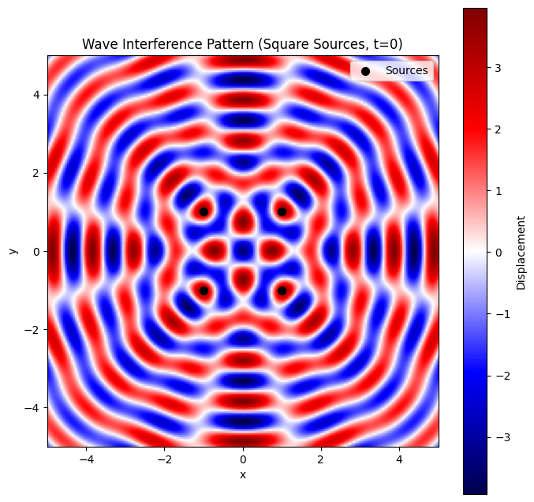
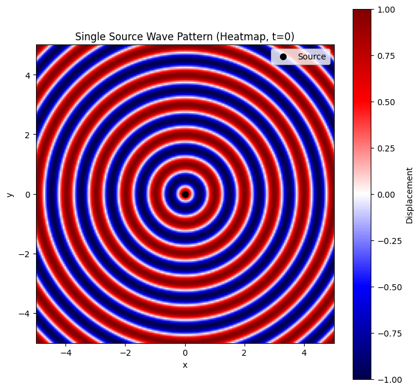
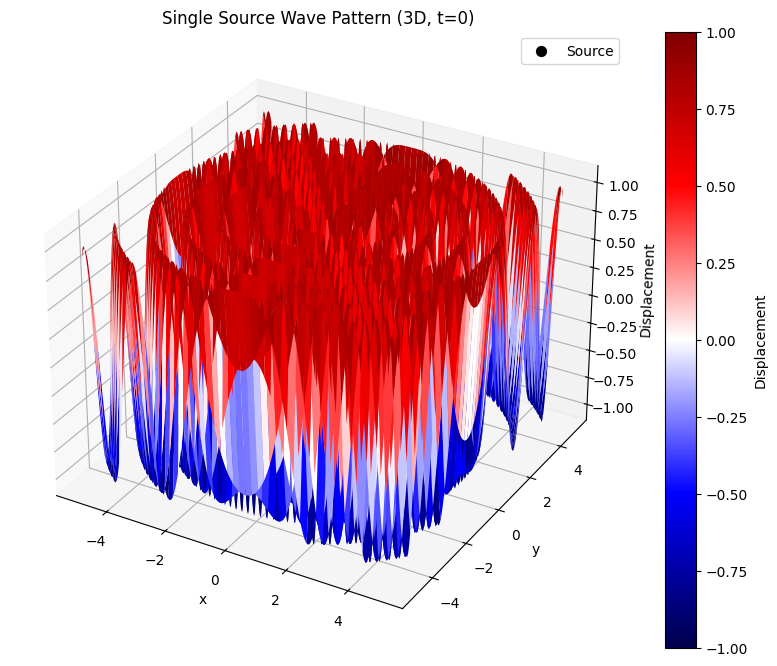
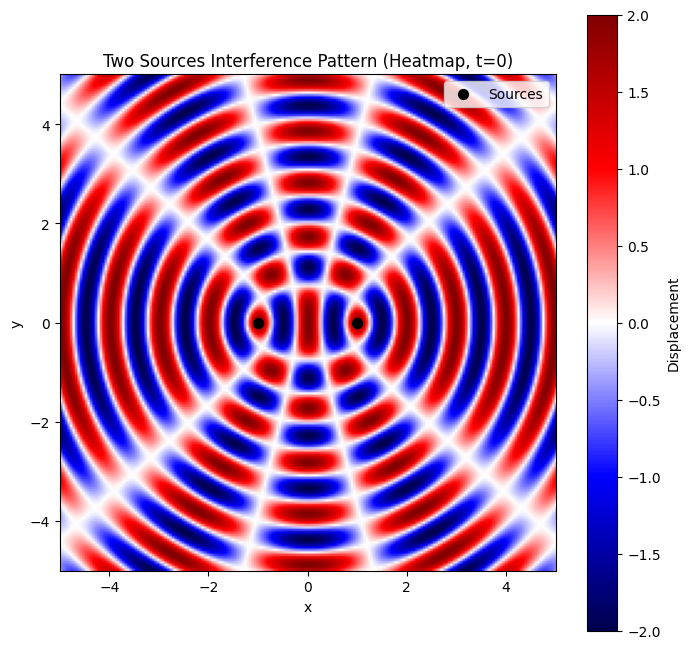
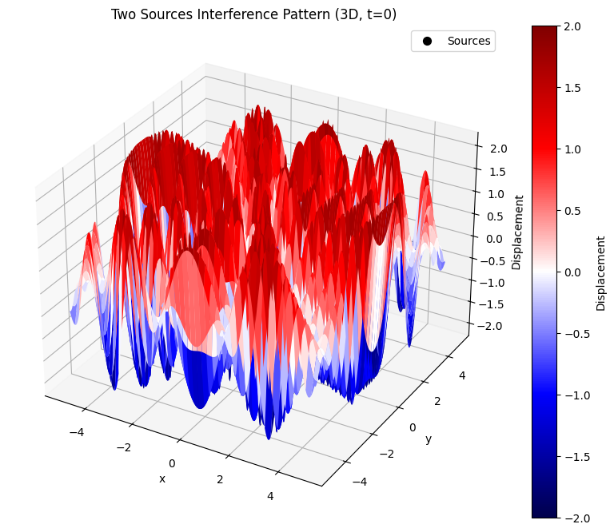
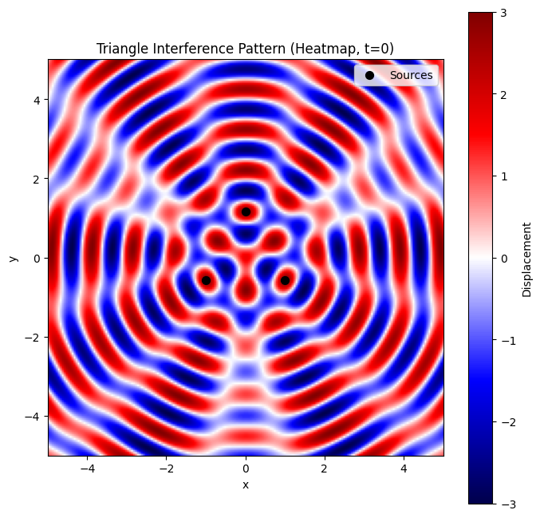
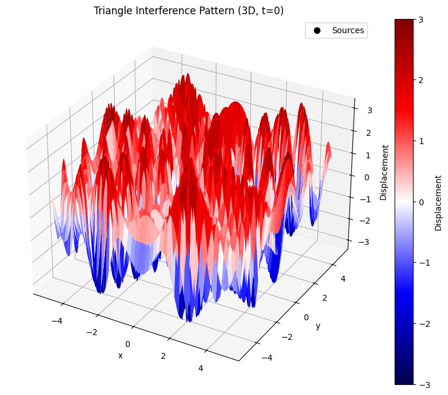
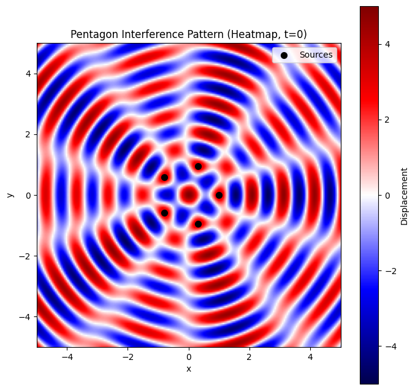
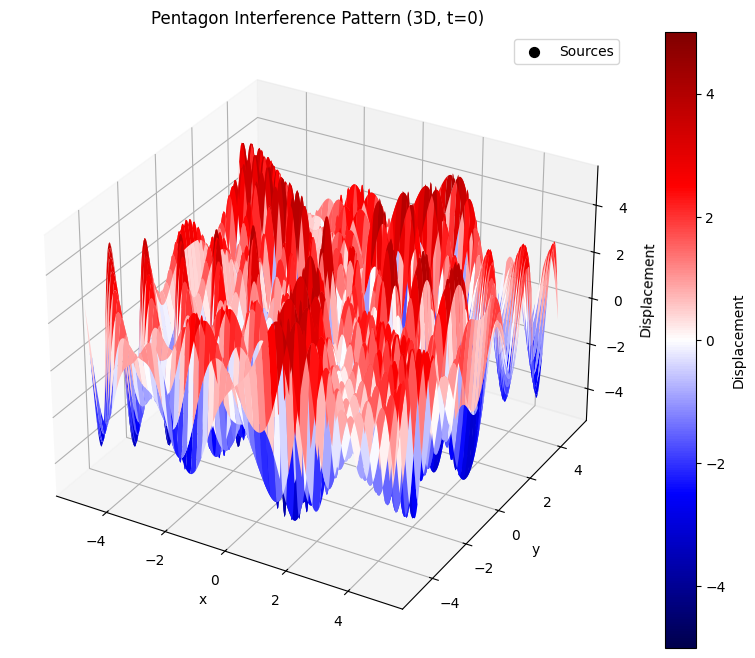

# Problem 1
# Wave Interference Patterns on a Water Surface

This document analyzes interference patterns created by coherent point sources placed at the vertices of a square. We simulate the wave propagation and visualize the resulting patterns using Python.

## Problem Setup


1) **Polygon:** Square


2) **Number of sources:** 4


3) **Source positions:** Vertices of a square centered at origin with side length 2 units


4) **Wave parameters:**


• Amplitude (A) = 1 unit


•Wavelength (λ) = 1 unit


•Frequency (f) = 1 Hz


•Initial phase (φ) = 0 for all sources

## Methodology


Define the wave equation for each source.


Apply superposition to compute total displacement.


Simulate over a 2D grid to visualize interference patterns.


Identify constructive and destructive interference regions.

## Wave Equation

For a source at position ((x_i, y_i)), the displacement at point ((x, y)) and time (t) is: $eta_i(x, y, t) = A \cos k r_i - \omega t + \phi$ where:


$r_i = \sqrt{(x - x_i)^2 + (y - y_i)^2}$


$k = \frac{2\pi}{\lambda}$


$omega = 2\pi f$

Total displacement is the sum: $eta(x, y, t) = \sum_{i=1}^N \eta_i(x, y, t)$

## Python Implementation

Below is the Python code to simulate and visualize the interference patterns.

```python
import numpy as np
import matplotlib.pyplot as plt

# Wave parameters
A = 1.0  # Amplitude
lambda_ = 1.0  # Wavelength
k = 2 * np.pi / lambda_  # Wave number
f = 1.0  # Frequency
omega = 2 * np.pi * f  # Angular frequency
phi = 0.0  # Phase
t = 0.0  # Time snapshot

# Square vertices (side length = 2, centered at origin)
sources = np.array([
    [1, 1],   # Top-right
    [1, -1],  # Bottom-right
    [-1, -1], # Bottom-left
    [-1, 1]   # Top-left
])

# Grid setup
x = np.linspace(-5, 5, 200)
y = np.linspace(-5, 5, 200)
X, Y = np.meshgrid(x, y)
eta_total = np.zeros_like(X)

# Compute total displacement
for source in sources:
    x_i, y_i = source
    r = np.sqrt((X - x_i)**2 + (Y - y_i)**2)
    eta_i = A * np.cos(k * r - omega * t + phi)
    eta_total += eta_i

# Plotting
plt.figure(figsize=(8, 8))
plt.imshow(eta_total, extent=[-5, 5, -5, 5], cmap='seismic', origin='lower')
plt.colorbar(label='Displacement')
plt.scatter(sources[:, 0], sources[:, 1], c='black', s=50, label='Sources')
plt.title('Wave Interference Pattern (Square Sources, t=0)')
plt.xlabel('x')
plt.ylabel('y')
plt.legend()
plt.grid(False)
plt.savefig('interference_pattern.png')
```



## Results and Analysis

The visualization shows the interference pattern at (t = 0):


**Constructive Interference:** Bright red regions where waves reinforce (high positive displacement).


**Destructive Interference:** Dark blue regions where waves cancel (near-zero displacement).


**Pattern Characteristics:**


• Symmetrical patterns due to the square's symmetry.


• Central region shows complex interference due to equal distances from all sources.


• Radiating patterns extend outward, with alternating constructive and destructive bands.

### Observations

The square arrangement produces a grid-like pattern with strong interference along the axes and diagonals.


Constructive interference occurs where path differences are integer multiples of the wavelength $lambda$.


Destructive interference occurs where path differences are odd multiples of half the wavelength $lambda/2$.

## Conclusion

This simulation demonstrates how coherent wave sources at the vertices of a square create intricate interference patterns. The patterns reveal the principles of superposition, with clear regions of constructive and destructive interference. Extending this to other polygons (e.g., triangle, pentagon) would yield different symmetries and patterns, further illustrating wave interactions.

## Single Source Wave Visualization

This document visualizes the wave pattern produced by a single point source on a water surface, using a heatmap and a 3D surface plot. The wave is described by the single disturbance equation, and no interference occurs since there is only one source.

## Python Implementation

The following code generates the heatmap and 3D surface plot for the single source wave pattern.

```python
import numpy as np
import matplotlib.pyplot as plt
from mpl_toolkits.mplot3d import Axes3D

# Wave parameters
A = 1.0  # Amplitude
lambda_ = 1.0  # Wavelength
k = 2 * np.pi / lambda_  # Wave number
f = 1.0  # Frequency
omega = 2 * np.pi * f  # Angular frequency
phi = 0.0  # Phase
t = 0.0  # Time snapshot

# Grid setup
x = np.linspace(-5, 5, 200)
y = np.linspace(-5, 5, 200)
X, Y = np.meshgrid(x, y)

# Source position
source = np.array([[0, 0]])

# Compute displacement
r = np.sqrt(X**2 + Y**2)
eta = A * np.cos(k * r - omega * t + phi)

# Heatmap
plt.figure(figsize=(8, 8))
plt.imshow(eta, extent=[-5, 5, -5, 5], cmap='seismic', origin='lower', vmin=-A, vmax=A)
plt.colorbar(label='Displacement')
plt.scatter(source[:, 0], source[:, 1], c='black', s=50, label='Source')
plt.title('Single Source Wave Pattern (Heatmap, t=0)')
plt.xlabel('x')
plt.ylabel('y')
plt.legend()
plt.grid(False)
plt.savefig('single_source_heatmap.png')
plt.close()

# 3D Surface Plot
fig = plt.figure(figsize=(10, 8))
ax = fig.add_subplot(111, projection='3d')
surf = ax.plot_surface(X, Y, eta, cmap='seismic', vmin=-A, vmax=A)
ax.scatter(source[:, 0], source[:, 1], [0], c='black', s=50, label='Source')
ax.set_title('Single Source Wave Pattern (3D, t=0)')
ax.set_xlabel('x')
ax.set_ylabel('y')
ax.set_zlabel('Displacement')
fig.colorbar(surf, ax=ax, label='Displacement')
ax.legend()
plt.savefig('single_source_3d.png')
plt.close()
```





```python
import numpy as np
import matplotlib.pyplot as plt
from mpl_toolkits.mplot3d import Axes3D
import os

# Ensure interactive backend (comment out if causing issues)
try:
    import matplotlib
    matplotlib.use('TkAgg')  # Use TkAgg for interactive display; try 'Qt5Agg' if TkAgg fails
except:
    pass

# Wave parameters
A = 1.0  # Amplitude
lambda_ = 1.0  # Wavelength
k = 2 * np.pi / lambda_  # Wave number
f = 1.0  # Frequency
omega = 2 * np.pi * f  # Angular frequency
phi = 0.0  # Phase
t = 0.0  # Time snapshot

# Grid setup
x = np.linspace(-5, 5, 200)
y = np.linspace(-5, 5, 200)
X, Y = np.meshgrid(x, y)

# Source positions
sources = np.array([[-1, 0], [1, 0]])

# Compute total displacement
eta_total = np.zeros_like(X)
for x_i, y_i in sources:
    r = np.sqrt((X - x_i)**2 + (Y - y_i)**2)
    eta_i = A * np.cos(k * r - omega * t + phi)
    eta_total += eta_i

# Heatmap
plt.figure(figsize=(8, 8))
plt.imshow(eta_total, extent=[-5, 5, -5, 5], cmap='seismic', origin='lower', vmin=-2*A, vmax=2*A)
plt.colorbar(label='Displacement')
plt.scatter(sources[:, 0], sources[:, 1], c='black', s=50, label='Sources')
plt.title('Two Sources Interference Pattern (Heatmap, t=0)')
plt.xlabel('x')
plt.ylabel('y')
plt.legend()
plt.grid(False)
plt.savefig('two_sources_heatmap.png')
plt.show()

# 3D Surface Plot
fig = plt.figure(figsize=(10, 8))
ax = fig.add_subplot(111, projection='3d')
surf = ax.plot_surface(X, Y, eta_total, cmap='seismic', vmin=-2*A, vmax=2*A)
ax.scatter(sources[:, 0], sources[:, 1], [0, 0], c='black', s=50, label='Sources')
ax.set_title('Two Sources Interference Pattern (3D, t=0)')
ax.set_xlabel('x')
ax.set_ylabel('y')
ax.set_zlabel('Displacement')
fig.colorbar(surf, ax=ax, label='Displacement')
ax.legend()
plt.savefig('two_sources_3d.png')
plt.show()

# Print working directory for saved files
print(f"Plots saved in: {os.getcwd()}")
```





```python
import numpy as np
import matplotlib.pyplot as plt
from mpl_toolkits.mplot3d import Axes3D
import os

# Ensure interactive backend (comment out if causing issues)
try:
    import matplotlib
    matplotlib.use('TkAgg')  # Use TkAgg for interactive display; try 'Qt5Agg' if TkAgg fails
except:
    pass

# Wave parameters
A = 1.0  # Amplitude
lambda_ = 1.0  # Wavelength
k = 2 * np.pi / lambda_  # Wave number
f = 1.0  # Frequency
omega = 2 * np.pi * f  # Angular frequency
phi = 0.0  # Phase
t = 0.0  # Time snapshot

# Grid setup
x = np.linspace(-5, 5, 200)
y = np.linspace(-5, 5, 200)
X, Y = np.meshgrid(x, y)

# Source configurations
# Triangle: Equilateral with side length 2, centered at origin
triangle_sources = np.array([
    [0, 2/np.sqrt(3)],           # Top vertex
    [-1, -1/np.sqrt(3)],         # Bottom-left
    [1, -1/np.sqrt(3)]           # Bottom-right
])

# Pentagon: Regular pentagon with radius 1, centered at origin
pentagon_sources = np.array([
    [np.cos(2*np.pi*i/5), np.sin(2*np.pi*i/5)] for i in range(5)
])

# Function to compute total displacement
def compute_displacement(X, Y, sources, t):
    eta_total = np.zeros_like(X)
    for x_i, y_i in sources:
        r = np.sqrt((X - x_i)**2 + (Y - y_i)**2)
        eta_i = A * np.cos(k * r - omega * t + phi)
        eta_total += eta_i
    return eta_total

# Function to plot heatmap
def plot_heatmap(eta, sources, title, filename, max_amplitude):
    plt.figure(figsize=(8, 8))
    plt.imshow(eta, extent=[-5, 5, -5, 5], cmap='seismic', origin='lower', vmin=-max_amplitude, vmax=max_amplitude)
    plt.colorbar(label='Displacement')
    plt.scatter(sources[:, 0], sources[:, 1], c='black', s=50, label='Sources')
    plt.title(title)
    plt.xlabel('x')
    plt.ylabel('y')
    plt.legend()
    plt.grid(False)
    plt.savefig(filename)
    plt.show()

# Function to plot 3D surface
def plot_3d(eta, sources, title, filename, max_amplitude):
    fig = plt.figure(figsize=(10, 8))
    ax = fig.add_subplot(111, projection='3d')
    surf = ax.plot_surface(X, Y, eta, cmap='seismic', vmin=-max_amplitude, vmax=max_amplitude)
    ax.scatter(sources[:, 0], sources[:, 1], np.zeros(len(sources)), c='black', s=50, label='Sources')
    ax.set_title(title)
    ax.set_xlabel('x')
    ax.set_ylabel('y')
    ax.set_zlabel('Displacement')
    fig.colorbar(surf, ax=ax, label='Displacement')
    ax.legend()
    plt.savefig(filename)
    plt.show()

# Generate plots for triangle
eta_triangle = compute_displacement(X, Y, triangle_sources, t)
plot_heatmap(eta_triangle, triangle_sources, 'Triangle Interference Pattern (Heatmap, t=0)', 
             'triangle_heatmap.png', max_amplitude=3*A)
plot_3d(eta_triangle, triangle_sources, 'Triangle Interference Pattern (3D, t=0)', 
        'triangle_3d.png', max_amplitude=3*A)

# Generate plots for pentagon
eta_pentagon = compute_displacement(X, Y, pentagon_sources, t)
plot_heatmap(eta_pentagon, pentagon_sources, 'Pentagon Interference Pattern (Heatmap, t=0)', 
             'pentagon_heatmap.png', max_amplitude=5*A)
plot_3d(eta_pentagon, pentagon_sources, 'Pentagon Interference Pattern (3D, t=0)', 
        'pentagon_3d.png', max_amplitude=5*A)

# Print working directory for saved files
print(f"Plots saved in: {os.getcwd()}")
```









```python
import numpy as np
import matplotlib.pyplot as plt
import imageio.v2 as imageio  # Use imageio.v2 to avoid deprecation warning
import os
from IPython.display import Image, display  # Import for inline display in Colab
 
# Wave parameters
A = 1.0  # Amplitude
lambda_ = 1.0  # Wavelength
k = 2 * np.pi / lambda_  # Wave number
f = 1.0  # Frequency
omega = 2 * np.pi * f  # Angular frequency
phi = 0.0  # Phase

# Grid setup
x = np.linspace(-5, 5, 200)
y = np.linspace(-5, 5, 200)
X, Y = np.meshgrid(x, y)

# Source position
source = np.array([[0, 0]])

# Function to compute displacement
def compute_displacement(X, Y, t):
    r = np.sqrt(X**2 + Y**2)
    eta = A * np.cos(k * r - omega * t + phi)
    return eta

# Create animation frames
frames = []
times = np.linspace(0, 1/f, 30)  # One period with 30 frames for smoother animation
temp_files = []

for t in times:
    eta = compute_displacement(X, Y, t)
    filename = f'temp_frame_{t:.3f}.png'
    temp_files.append(filename)
    
    plt.figure(figsize=(8, 8))
    plt.imshow(eta, extent=[-5, 5, -5, 5], cmap='seismic', origin='lower', vmin=-A, vmax=A)
    plt.colorbar(label='Amplitude')
    plt.scatter(source[:, 0], source[:, 1], c='black', s=50, label='Source')
    plt.title(f'Wave Animation (t={t:.2f}s)')
    plt.xlabel('x')
    plt.ylabel('y')
    plt.legend()
    plt.grid(False)
    plt.savefig(filename)
    plt.close()
    
    frames.append(imageio.imread(filename))

# Create GIF
gif_filename = 'wave_animation.gif'
imageio.mimsave(gif_filename, frames, duration=0.1)  # 0.1 seconds per frame

# Clean up temporary files
for fname in temp_files:
    os.remove(fname)

# Display the GIF inline in Colab
display(Image(filename=gif_filename))

# Print working directory for reference
print(f"GIF saved in: {os.getcwd()}")

# Verify the GIF file exists
if os.path.exists(gif_filename):
    print(f"File size of {gif_filename}: {os.path.getsize(gif_filename)} bytes")
else:
    print(f"Error: {gif_filename} was not created.")
```

