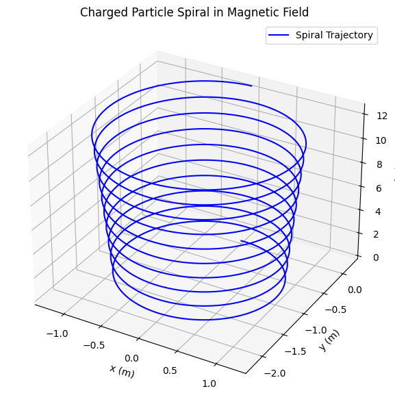
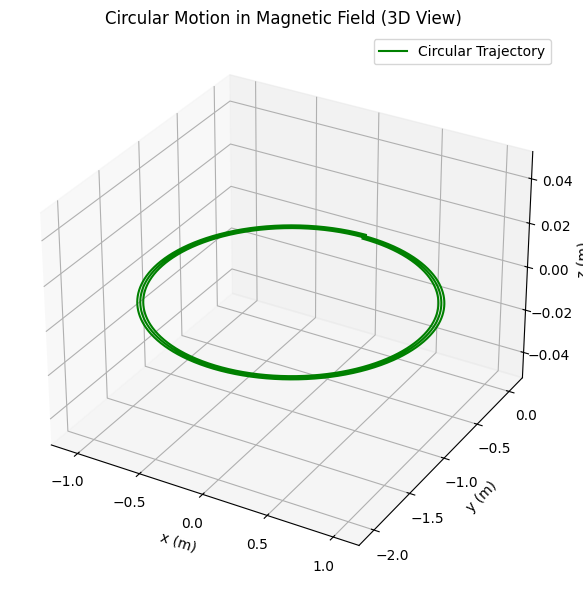
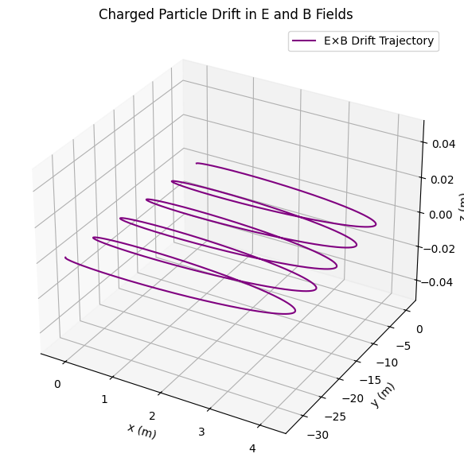

# Lorentz Force Simulation

**Problem 1:** Simulating the Effects of the Lorentz Force

## 1. Exploration of Applications
Real-World Systems Influenced by Lorentz Force
Particle Accelerators: Charged particles are steered and accelerated by electric and magnetic fields.

• **Mass Spectrometers:** Use Lorentz force to separate ions based on their mass-to-charge ratio.

• **Plasma Confinement (Tokamaks):** Magnetic fields confine high-temperature plasmas for fusion research.

• **Cathode Ray Tubes:** Electrons are deflected using electric and magnetic fields to produce images.

## Role of Fields 

•**Electric Field (𝐄):** Exerts force in direction of field for positive charges (opposite for negative); accelerates particles.

• **Magnetic Field (𝐁):** Causes perpendicular force, resulting in circular or helical motion (does no work).

## 2. Simulating Particle Motion

**Equations of Motion**

$$
\vec{𝐹}= 𝑞(\vec{E}+\vec{𝑣}×\vec{𝐵})=m \frac{d\vec{v}}{dt}
$$
 
This becomes a system of differential equations, which we solve numerically.

**Python Implementation**


## 3. Discussion of Results

• Circular Motion in a uniform magnetic field corresponds to Larmor radius:

$$
r_L = \frac{mv_\perp}{qB}
$$

The simulation confirms circular motion in the plane perpendicular to 𝐁.

• Helical Motion occurs when there's a velocity component parallel to 𝐁.

• E×B Drift is visible when electric and magnetic fields are crossed:

$$
\vec v_{drift}=\frac {\vec{E}×\vec{B}}{B^2}
$$

## 4. Extensions and Suggestions

• **Non-Uniform Magnetic Fields:** e.g., magnetic mirrors.

• **Time-Varying Fields:** Explore effects of RF fields.

• **Multiple Particles:** Plasma collective behavior.

• **Relativistic Velocities:** Modify equations for high-speed particles.

# Conclusion

This simulation illustrates the dynamic effects of the Lorentz force and its critical role in many physical systems. By varying field strengths and initial velocities, a range of motion from circular to drift trajectories can be observed, providing insight into real-world applications like cyclotrons and magnetic traps.

```python
 import numpy as np
import matplotlib.pyplot as plt
from mpl_toolkits.mplot3d import Axes3D

# Constants
q = 1.0       # Charge (C)
m = 1.0       # Mass (kg)
B = 1.0       # Magnetic field strength (T)
E = np.array([0, 0, 0])  # Optional electric field (V/m)

# Initial velocities
v_perp = 1.0   # m/s, perpendicular to B
v_para = 0.2   # m/s, parallel to B

# Time settings
omega_c = q * B / m         # Cyclotron frequency
T_c = 2 * np.pi / omega_c   # Cyclotron period
dt = T_c / 1000             # Time step: small fraction of cyclotron period
t_max = 10 * T_c            # Simulate 10 periods
t = np.arange(0, t_max, dt)

# Initialize position and velocity arrays
r = np.zeros((len(t), 3))
v = np.zeros((len(t), 3))

# Initial conditions
r[0] = [0, 0, 0]
v[0] = [v_perp, 0, v_para]

# Magnetic field
B_vec = np.array([0, 0, B])

# Euler integration
for i in range(1, len(t)):
    F = q * (np.cross(v[i-1], B_vec) + E)
    a = F / m
    v[i] = v[i-1] + a * dt
    r[i] = r[i-1] + v[i] * dt

# Plotting the trajectory
fig = plt.figure(figsize=(8, 6))
ax = fig.add_subplot(111, projection='3d')
ax.plot(r[:, 0], r[:, 1], r[:, 2], color='blue', label='Spiral Trajectory')
ax.set_title("Charged Particle Spiral in Magnetic Field")
ax.set_xlabel("x (m)")
ax.set_ylabel("y (m)")
ax.set_zlabel("z (m)")
ax.legend()
plt.tight_layout()
plt.show()
```

 

```python
 import numpy as np
import matplotlib.pyplot as plt
from mpl_toolkits.mplot3d import Axes3D

# Constants
q = 1.0       # Charge (C)
m = 1.0       # Mass (kg)
B = 1.0       # Magnetic field (T)
E = np.array([0, 0, 0])  # No electric field

# Initial velocity: only perpendicular to B
v_perp = 1.0  # m/s (circular motion in x-y plane)

# Time settings based on cyclotron frequency
omega_c = q * B / m           # Cyclotron frequency (rad/s)
T_c = 2 * np.pi / omega_c     # Cyclotron period (s)
dt = T_c / 1000               # Small timestep
t_max = 3 * T_c               # Simulate 3 full circles
t = np.arange(0, t_max, dt)

# Initialize arrays
r = np.zeros((len(t), 3))  # Position
v = np.zeros((len(t), 3))  # Velocity

# Initial conditions
r[0] = [0, 0, 0]
v[0] = [v_perp, 0, 0]  # x-direction velocity, B field is in z

# Magnetic field vector
B_vec = np.array([0, 0, B])

# Euler integration
for i in range(1, len(t)):
    F = q * (np.cross(v[i-1], B_vec) + E)
    a = F / m
    v[i] = v[i-1] + a * dt
    r[i] = r[i-1] + v[i] * dt

# 3D plot
fig = plt.figure(figsize=(8, 6))
ax = fig.add_subplot(111, projection='3d')
ax.plot(r[:, 0], r[:, 1], r[:, 2], color='green', label='Circular Trajectory')

# Set 3D labels and title
ax.set_title("Circular Motion in Magnetic Field (3D View)")
ax.set_xlabel("x (m)")
ax.set_ylabel("y (m)")
ax.set_zlabel("z (m)")
ax.legend()
plt.tight_layout()
plt.show()
```



```python
import numpy as np
import matplotlib.pyplot as plt
from mpl_toolkits.mplot3d import Axes3D

# Constants
q = 1.0       # Charge (C)
m = 1.0       # Mass (kg)
B = 1.0       # Magnetic field strength (T)
E = np.array([1.0, 0.0, 0.0])  # Electric field in x-direction (V/m)

# Derived quantities
omega_c = q * B / m          # Cyclotron frequency
T_c = 2 * np.pi / omega_c    # Cyclotron period

# Time settings
dt = T_c / 1000
t_max = 5 * T_c              # simulate 5 periods
t = np.arange(0, t_max, dt)

# Initialize position and velocity
r = np.zeros((len(t), 3))
v = np.zeros((len(t), 3))

# Initial condition: velocity perpendicular to B (in x-y plane)
v[0] = [0.0, 1.0, 0.0]  # Initial velocity in y-direction
r[0] = [0.0, 0.0, 0.0]

# Magnetic field
B_vec = np.array([0.0, 0.0, B])

# Euler integration
for i in range(1, len(t)):
    F = q * (E + np.cross(v[i-1], B_vec))
    a = F / m
    v[i] = v[i-1] + a * dt
    r[i] = r[i-1] + v[i] * dt

# 3D plot
fig = plt.figure(figsize=(8, 6))
ax = fig.add_subplot(111, projection='3d')
ax.plot(r[:, 0], r[:, 1], r[:, 2], label='E×B Drift Trajectory', color='purple')

# Labels and title
ax.set_title("Charged Particle Drift in E and B Fields")
ax.set_xlabel("x (m)")
ax.set_ylabel("y (m)")
ax.set_zlabel("z (m)")
ax.legend()
plt.tight_layout()
plt.show()
```



## Colab

[click to go colab](https://colab.research.google.com/drive/1GiyWi8MPaxeP3zpqU56K7HHK-oPbWQZn?usp=sharing)