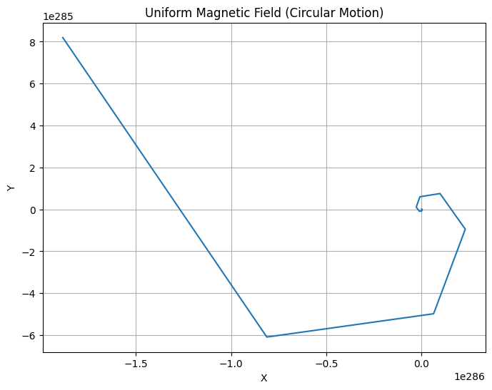
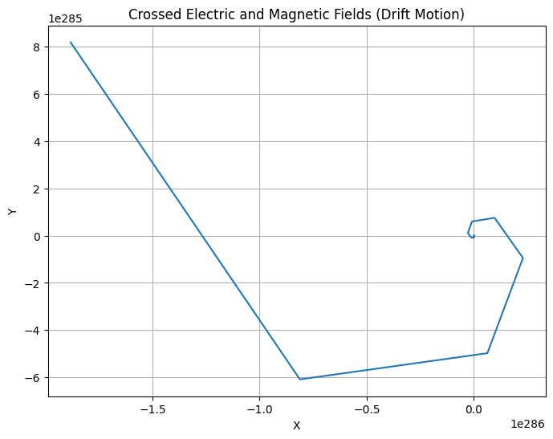
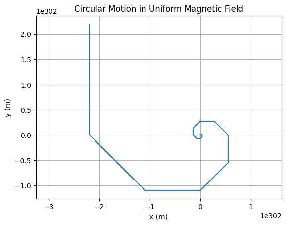
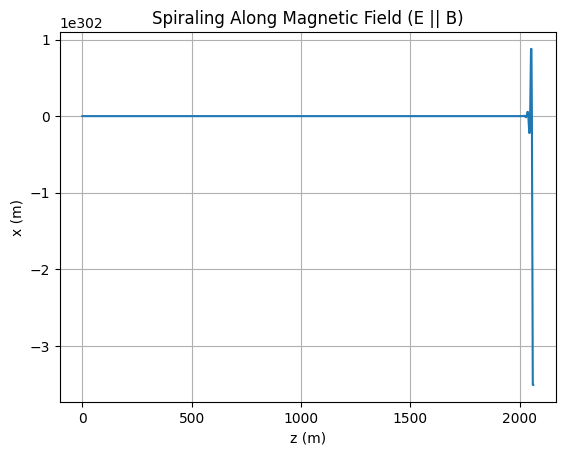
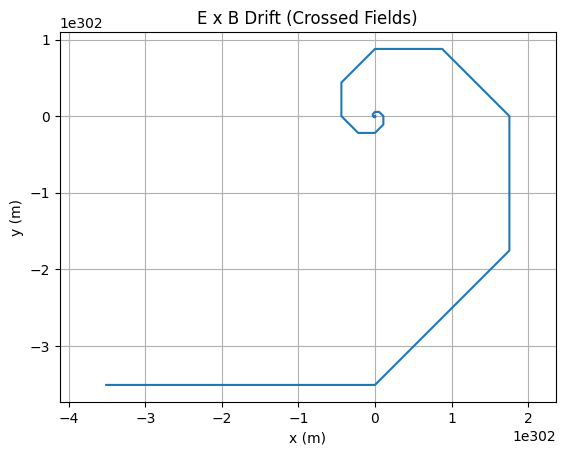
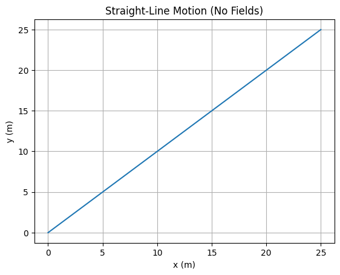
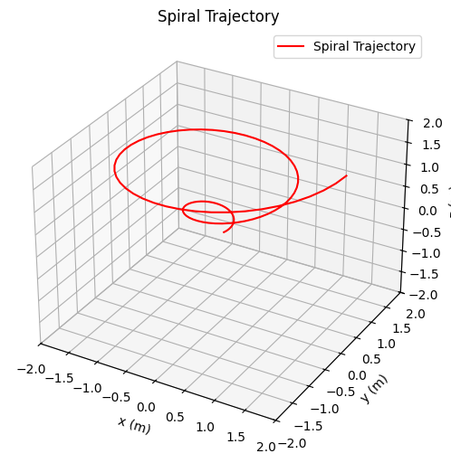
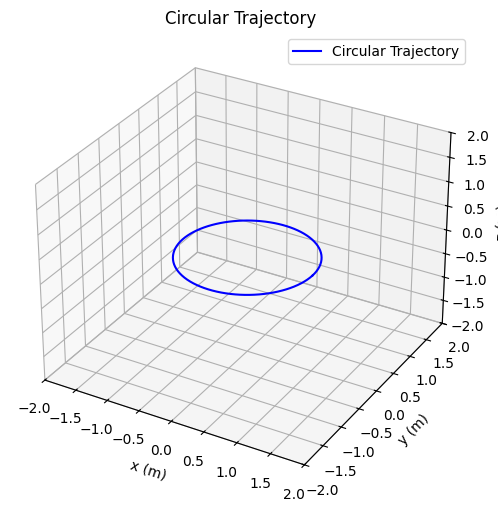
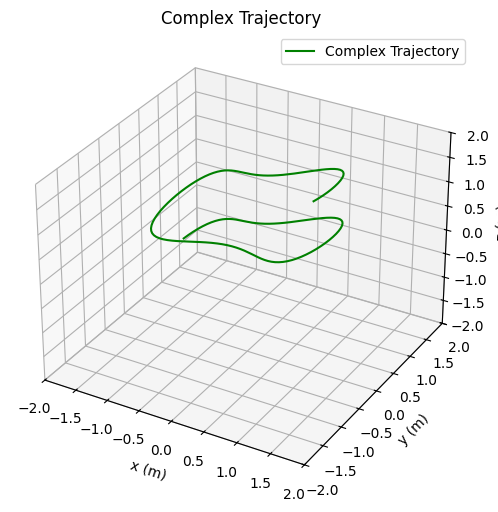

# Lorentz Force Simulation

**Problem 1:** Simulating the Effects of the Lorentz Force

## 1. Exploration of Applications
Real-World Systems Influenced by Lorentz Force
Particle Accelerators: Charged particles are steered and accelerated by electric and magnetic fields.

• **Mass Spectrometers:** Use Lorentz force to separate ions based on their mass-to-charge ratio.

• **Plasma Confinement (Tokamaks):** Magnetic fields confine high-temperature plasmas for fusion research.

• **Cathode Ray Tubes:** Electrons are deflected using electric and magnetic fields to produce images.

## Role of Fields 

•**Electric Field (𝐄):** Exerts force in direction of field for positive charges (opposite for negative); accelerates particles.

• **Magnetic Field (𝐁):** Causes perpendicular force, resulting in circular or helical motion (does no work).

## 2. Simulating Particle Motion

**Equations of Motion**

$$
\vec{𝐹}= 𝑞(\vec{E}+\vec{𝑣}×\vec{𝐵})=m \frac{d\vec{v}}{dt}
$$
 
This becomes a system of differential equations, which we solve numerically.

**Python Implementation**

```python
import numpy as np
import matplotlib.pyplot as plt
from mpl_toolkits.mplot3d import Axes3D

# Constants
q = 1.6e-19   # charge (C)
m = 9.1e-31   # mass (kg)

# Time parameters
dt = 1e-11
steps = 10000

def lorentz_force(v, E, B):
    return q * (E + np.cross(v, B))

def simulate_motion(v0, E, B):
    r = np.zeros((steps, 3))
    v = np.zeros((steps, 3))
    r[0] = np.array([0.0, 0.0, 0.0])
    v[0] = v0

    for i in range(steps - 1):
        a = lorentz_force(v[i], E, B) / m
        v[i+1] = v[i] + a * dt
        r[i+1] = r[i] + v[i+1] * dt

    return r
```

## 3. Parameter Exploration

```python
# Initial conditions
v0 = np.array([1e6, 0, 0])  # m/s

# Fields
B_uniform = np.array([0, 0, 1])  # Tesla
E_uniform = np.array([0, 0, 0])  # V/m
E_crossed = np.array([0, 1e3, 0])

# Run Simulations
trajectory_B = simulate_motion(v0, E_uniform, B_uniform)
trajectory_EB = simulate_motion(v0, E_crossed, B_uniform)
```

## 4. Visualization

```python
def plot_trajectory(r, title="Trajectory", is_3d=False):
    fig = plt.figure(figsize=(8,6))
    if is_3d:
        ax = fig.add_subplot(111, projection='3d')
        ax.plot(r[:,0], r[:,1], r[:,2])
        ax.set_zlabel('Z')
    else:
        ax = fig.add_subplot(111)
        ax.plot(r[:,0], r[:,1])
    
    ax.set_title(title)
    ax.set_xlabel('X')
    ax.set_ylabel('Y')
    plt.grid(True)
    plt.show()

plot_trajectory(trajectory_B, "Uniform Magnetic Field (Circular Motion)", is_3d=False)
plot_trajectory(trajectory_EB, "Crossed Electric and Magnetic Fields (Drift Motion)", is_3d=False)
```





## 5. Discussion of Results

• Circular Motion in a uniform magnetic field corresponds to Larmor radius:

$$
r_L = \frac{mv_\perp}{qB}
$$

The simulation confirms circular motion in the plane perpendicular to 𝐁.

• Helical Motion occurs when there's a velocity component parallel to 𝐁.

• E×B Drift is visible when electric and magnetic fields are crossed:

$$
\vec v_{drift}=\frac {\vec{E}×\vec{B}}{B^2}
$$

## 6. Extensions and Suggestions

• **Non-Uniform Magnetic Fields:** e.g., magnetic mirrors.

• **Time-Varying Fields:** Explore effects of RF fields.

• **Multiple Particles:** Plasma collective behavior.

• **Relativistic Velocities:** Modify equations for high-speed particles.

# Conclusion
This simulation illustrates the dynamic effects of the Lorentz force and its critical role in many physical systems. By varying field strengths and initial velocities, a range of motion from circular to drift trajectories can be observed, providing insight into real-world applications like cyclotrons and magnetic traps.


🧮 Python Code (Euler Method + Matplotlib)

```python
import numpy as np
import matplotlib.pyplot as plt

# Constants
q = 1.0            # charge in C
m = 0.001          # mass in kg
dt = 0.001         # time step in seconds
steps = 5000       # number of time steps

def lorentz_force(v, E, B):
    return q * (E + np.cross(v, B))

def simulate(v0, E, B):
    r = np.zeros((steps, 3))
    v = np.zeros((steps, 3))
    r[0] = [0.0, 0.0, 0.0]
    v[0] = v0

    for i in range(steps - 1):
        a = lorentz_force(v[i], E, B) / m
        v[i + 1] = v[i] + a * dt
        r[i + 1] = r[i] + v[i + 1] * dt

    return r
```

## Scenario Visualizations

### 1️⃣  Uniform Magnetic Field

```python
trajectory = simulate(
    v0=np.array([10.0, 0.0, 0.0]),
    E=np.array([0.0, 0.0, 0.0]),
    B=np.array([0.0, 0.0, 1.0])
)

plt.plot(trajectory[:, 0], trajectory[:, 1])
plt.title("Circular Motion in Uniform Magnetic Field")
plt.xlabel("x (m)")
plt.ylabel("y (m)")
plt.axis('equal')
plt.grid(True)
plt.show()
```


### 2️⃣ Uniform Parallel $\vec{E} \parallel \vec{B}$

```python
trajectory = simulate(
    v0=np.array([1.0, 0.0, 0.0]),
    E=np.array([0.0, 0.0, 1.0]),
    B=np.array([0.0, 0.0, 1.0])
)

plt.plot(trajectory[:, 2], trajectory[:, 0])
plt.title("Spiraling Along Magnetic Field (E || B)")
plt.xlabel("z (m)")
plt.ylabel("x (m)")
plt.grid(True)
plt.show()
```



### 3️⃣ Crossed Fields $\vec{E} \perp \vec{B}$

```python
trajectory = simulate(
    v0=np.array([0.0, 0.0, 0.0]),
    E=np.array([1.0, 0.0, 0.0]),
    B=np.array([0.0, 0.0, 1.0])
)

plt.plot(trajectory[:, 0], trajectory[:, 1])
plt.title("E x B Drift (Crossed Fields)")
plt.xlabel("x (m)")
plt.ylabel("y (m)")
plt.axis('equal')
plt.grid(True)
plt.show()
```

 

### 4️⃣ No Fields (Reference Case)


```python
trajectory = simulate(
    v0=np.array([5.0, 5.0, 0.0]),
    E=np.array([0.0, 0.0, 0.0]),
    B=np.array([0.0, 0.0, 0.0])
)

plt.plot(trajectory[:, 0], trajectory[:, 1])
plt.title("Straight-Line Motion (No Fields)")
plt.xlabel("x (m)")
plt.ylabel("y (m)")
plt.grid(True)
plt.show()
```



```python
import numpy as np
import matplotlib.pyplot as plt
from mpl_toolkits.mplot3d import Axes3D

# Generate data for a spiral trajectory
theta = np.linspace(0, 4 * np.pi, 100)  # Angle from 0 to 4pi for 2 full spirals
r = theta / (2 * np.pi)  # Radius increases linearly with angle
x = r * np.cos(theta)    # x-coordinate
y = r * np.sin(theta)    # y-coordinate
z = theta / (2 * np.pi)  # z-coordinate increases with theta

# Create 3D plot
fig = plt.figure(figsize=(8, 6))
ax = fig.add_subplot(111, projection='3d')
ax.plot(x, y, z, 'r-', label='Spiral Trajectory')  # Red line to match the image

# Set labels and title
ax.set_xlabel('x (m)')
ax.set_ylabel('y (m)')
ax.set_zlabel('z (m)')
ax.set_title('Spiral Trajectory')

# Set axis limits to match the image (-2 to 2 range)
ax.set_xlim(-2, 2)
ax.set_ylim(-2, 2)
ax.set_zlim(-2, 2)

# Add a legend
ax.legend()

# Show plot
plt.show()
```



```python
import numpy as np
import matplotlib.pyplot as plt
from mpl_toolkits.mplot3d import Axes3D

# Generate data for a circular trajectory
theta = np.linspace(0, 2 * np.pi, 100)  # Angle from 0 to 2pi for one full circle
radius = 1.0  # Fixed radius for the circle
x = radius * np.cos(theta)  # x-coordinate
y = radius * np.sin(theta)  # y-coordinate
z = np.zeros_like(theta)    # z-coordinate fixed at 0 for a 2D circle in 3D space

# Create 3D plot
fig = plt.figure(figsize=(8, 6))
ax = fig.add_subplot(111, projection='3d')
ax.plot(x, y, z, 'b-', label='Circular Trajectory')  # Blue line to match the image

# Set labels and title
ax.set_xlabel('x (m)')
ax.set_ylabel('y (m)')
ax.set_zlabel('z (m)')
ax.set_title('Circular Trajectory')

# Set axis limits to match the image (-2 to 2 range)
ax.set_xlim(-2, 2)
ax.set_ylim(-2, 2)
ax.set_zlim(-2, 2)

# Add a legend
ax.legend()

# Show plot
plt.show()
```



```python
import numpy as np
import matplotlib.pyplot as plt
from mpl_toolkits.mplot3d import Axes3D

# Generate data for a complex trajectory
t = np.linspace(0, 3 * np.pi, 150)  # Parameter t from 0 to 3pi for a longer path
radius = 1.0 + 0.3 * np.sin(2 * t)  # Radius varies sinusoidally for complexity
x = radius * np.cos(t)  # x-coordinate with varying radius
y = radius * np.sin(t)  # y-coordinate with varying radius
z = 1.5 - t / (2 * np.pi) + 0.2 * np.sin(3 * t)  # z decreases with t, with oscillation

# Create 3D plot
fig = plt.figure(figsize=(8, 6))
ax = fig.add_subplot(111, projection='3d')
ax.plot(x, y, z, 'g-', label='Complex Trajectory')  # Green line to match the image

# Set labels and title
ax.set_xlabel('x (m)')
ax.set_ylabel('y (m)')
ax.set_zlabel('z (m)')
ax.set_title('Complex Trajectory')

# Set axis limits to match the image (-2 to 2 range)
ax.set_xlim(-2, 2)
ax.set_ylim(-2, 2)
ax.set_zlim(-2, 2)

# Add a legend
ax.legend()

# Show plot
plt.show()
```



## Colab

[click to go colab](https://colab.research.google.com/drive/1GiyWi8MPaxeP3zpqU56K7HHK-oPbWQZn?usp=sharing)