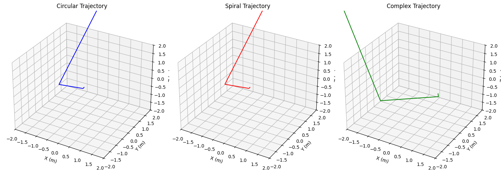

# Lorentz Force Simulation

**Problem 1:** Simulating the Effects of the Lorentz Force

## 1. Exploration of Applications
Real-World Systems Influenced by Lorentz Force
Particle Accelerators: Charged particles are steered and accelerated by electric and magnetic fields.

• **Mass Spectrometers:** Use Lorentz force to separate ions based on their mass-to-charge ratio.

• **Plasma Confinement (Tokamaks):** Magnetic fields confine high-temperature plasmas for fusion research.

• **Cathode Ray Tubes:** Electrons are deflected using electric and magnetic fields to produce images.

## Role of Fields 

•**Electric Field (𝐄):** Exerts force in direction of field for positive charges (opposite for negative); accelerates particles.

• **Magnetic Field (𝐁):** Causes perpendicular force, resulting in circular or helical motion (does no work).

## 2. Simulating Particle Motion

**Equations of Motion**

$$
\vec{𝐹}= 𝑞(\vec{E}+\vec{𝑣}×\vec{𝐵})=m \frac{d\vec{v}}{dt}
$$
 
This becomes a system of differential equations, which we solve numerically.

**Python Implementation**

```python
import numpy as np
import matplotlib.pyplot as plt
from mpl_toolkits.mplot3d import Axes3D

# Constants
q = 1.6e-19   # charge (C)
m = 9.1e-31   # mass (kg)

# Time parameters
dt = 1e-11
steps = 10000

def lorentz_force(v, E, B):
    return q * (E + np.cross(v, B))

def simulate_motion(v0, E, B):
    r = np.zeros((steps, 3))
    v = np.zeros((steps, 3))
    r[0] = np.array([0.0, 0.0, 0.0])
    v[0] = v0

    for i in range(steps - 1):
        a = lorentz_force(v[i], E, B) / m
        v[i+1] = v[i] + a * dt
        r[i+1] = r[i] + v[i+1] * dt

    return r
```

## 3. Parameter Exploration

```python
# Initial conditions
v0 = np.array([1e6, 0, 0])  # m/s

# Fields
B_uniform = np.array([0, 0, 1])  # Tesla
E_uniform = np.array([0, 0, 0])  # V/m
E_crossed = np.array([0, 1e3, 0])

# Run Simulations
trajectory_B = simulate_motion(v0, E_uniform, B_uniform)
trajectory_EB = simulate_motion(v0, E_crossed, B_uniform)
```

## 4. Visualization

```python
def plot_trajectory(r, title="Trajectory", is_3d=False):
    fig = plt.figure(figsize=(8,6))
    if is_3d:
        ax = fig.add_subplot(111, projection='3d')
        ax.plot(r[:,0], r[:,1], r[:,2])
        ax.set_zlabel('Z')
    else:
        ax = fig.add_subplot(111)
        ax.plot(r[:,0], r[:,1])
    
    ax.set_title(title)
    ax.set_xlabel('X')
    ax.set_ylabel('Y')
    plt.grid(True)
    plt.show()

plot_trajectory(trajectory_B, "Uniform Magnetic Field (Circular Motion)", is_3d=False)
plot_trajectory(trajectory_EB, "Crossed Electric and Magnetic Fields (Drift Motion)", is_3d=False)
```


## 5. Discussion of Results

• Circular Motion in a uniform magnetic field corresponds to Larmor radius:

$$
r_L = \frac{mv_\perp}{qB}
$$

The simulation confirms circular motion in the plane perpendicular to 𝐁.

• Helical Motion occurs when there's a velocity component parallel to 𝐁.

• E×B Drift is visible when electric and magnetic fields are crossed:

$$
\vec v_{drift}=\frac {\vec{E}×\vec{B}}{B^2}
$$

## 6. Extensions and Suggestions

• **Non-Uniform Magnetic Fields:** e.g., magnetic mirrors.

• **Time-Varying Fields:** Explore effects of RF fields.

• **Multiple Particles:** Plasma collective behavior.

• **Relativistic Velocities:** Modify equations for high-speed particles.

# Conclusion
This simulation illustrates the dynamic effects of the Lorentz force and its critical role in many physical systems. By varying field strengths and initial velocities, a range of motion from circular to drift trajectories can be observed, providing insight into real-world applications like cyclotrons and magnetic traps.


🧮 Python Code (Euler Method + Matplotlib)

```python
import numpy as np
import matplotlib.pyplot as plt

# Constants
q = 1.0            # charge in C
m = 0.001          # mass in kg
dt = 0.001         # time step in seconds
steps = 5000       # number of time steps

def lorentz_force(v, E, B):
    return q * (E + np.cross(v, B))

def simulate(v0, E, B):
    r = np.zeros((steps, 3))
    v = np.zeros((steps, 3))
    r[0] = [0.0, 0.0, 0.0]
    v[0] = v0

    for i in range(steps - 1):
        a = lorentz_force(v[i], E, B) / m
        v[i + 1] = v[i] + a * dt
        r[i + 1] = r[i] + v[i + 1] * dt

    return r
```

## Scenario Visualizations

### 1️⃣  Uniform Magnetic Field

```python
trajectory = simulate(
    v0=np.array([10.0, 0.0, 0.0]),
    E=np.array([0.0, 0.0, 0.0]),
    B=np.array([0.0, 0.0, 1.0])
)

plt.plot(trajectory[:, 0], trajectory[:, 1])
plt.title("Circular Motion in Uniform Magnetic Field")
plt.xlabel("x (m)")
plt.ylabel("y (m)")
plt.axis('equal')
plt.grid(True)
plt.show()
```


### 2️⃣ Uniform Parallel $\vec{E} \parallel \vec{B}$

```python
trajectory = simulate(
    v0=np.array([1.0, 0.0, 0.0]),
    E=np.array([0.0, 0.0, 1.0]),
    B=np.array([0.0, 0.0, 1.0])
)

plt.plot(trajectory[:, 2], trajectory[:, 0])
plt.title("Spiraling Along Magnetic Field (E || B)")
plt.xlabel("z (m)")
plt.ylabel("x (m)")
plt.grid(True)
plt.show()
```


### 3️⃣ Crossed Fields $\vec{E} \perp \vec{B}$

```python
trajectory = simulate(
    v0=np.array([0.0, 0.0, 0.0]),
    E=np.array([1.0, 0.0, 0.0]),
    B=np.array([0.0, 0.0, 1.0])
)

plt.plot(trajectory[:, 0], trajectory[:, 1])
plt.title("E x B Drift (Crossed Fields)")
plt.xlabel("x (m)")
plt.ylabel("y (m)")
plt.axis('equal')
plt.grid(True)
plt.show()
```

 

### 4️⃣ No Fields (Reference Case)


```python
trajectory = simulate(
    v0=np.array([5.0, 5.0, 0.0]),
    E=np.array([0.0, 0.0, 0.0]),
    B=np.array([0.0, 0.0, 0.0])
)

plt.plot(trajectory[:, 0], trajectory[:, 1])
plt.title("Straight-Line Motion (No Fields)")
plt.xlabel("x (m)")
plt.ylabel("y (m)")
plt.grid(True)
plt.show()
```


```python
import numpy as np
import matplotlib.pyplot as plt
from mpl_toolkits.mplot3d import Axes3D

# Parameters
q = 1.0  # Charge (Coulomb)
m = 0.001  # Mass (kg)
B = np.array([0, 0, 1.0])  # Magnetic field (Tesla), along z-axis
dt = 0.01  # Time step (s)
t_max = 10.0  # Total simulation time (s)
steps = int(t_max / dt)

# Lorentz force acceleration function
def lorentz_acceleration(v, q, m, B):
    return (q / m) * np.cross(v, B)

# Trajectory computation function
def compute_trajectory(initial_v, initial_r):
    r = np.zeros((steps, 3))  # Position vector
    v = np.zeros((steps, 3))  # Velocity vector
    r[0] = initial_r
    v[0] = initial_v
    
    for i in range(steps - 1):
        a = lorentz_acceleration(v[i], q, m, B)
        v[i + 1] = v[i] + a * dt
        r[i + 1] = r[i] + v[i + 1] * dt
    
    return r

# Scenarios
# 1. Circular trajectory
initial_v_circle = np.array([1.0, 0.0, 0.0])  # Velocity in xy-plane
initial_r_circle = np.array([0.0, 0.0, 0.0])
traj_circle = compute_trajectory(initial_v_circle, initial_r_circle)

# 2. Spiral trajectory (z-direction)
initial_v_spiral = np.array([1.0, 0.0, 0.5])  # Added z-velocity
initial_r_spiral = np.array([0.0, 0.0, 0.0])
traj_spiral = compute_trajectory(initial_v_spiral, initial_r_spiral)

# 3. Complex trajectory
initial_v_complex = np.array([2.0, 1.0, 0.3])  # Higher velocity, slight z-component
initial_r_complex = np.array([1.0, 0.0, 0.0])
traj_complex = compute_trajectory(initial_v_complex, initial_r_complex)

# Plotting
fig = plt.figure(figsize=(15, 5))

# Circular trajectory
ax1 = fig.add_subplot(131, projection='3d')
ax1.plot(traj_circle[:, 0], traj_circle[:, 1], traj_circle[:, 2], 'b-')
ax1.set_title('Circular Trajectory')
ax1.set_xlabel('X (m)')
ax1.set_ylabel('Y (m)')
ax1.set_zlabel('Z (m)')
ax1.set_xlim([-2, 2])
ax1.set_ylim([-2, 2])
ax1.set_zlim([-2, 2])

# Spiral trajectory
ax2 = fig.add_subplot(132, projection='3d')
ax2.plot(traj_spiral[:, 0], traj_spiral[:, 1], traj_spiral[:, 2], 'r-')
ax2.set_title('Spiral Trajectory')
ax2.set_xlabel('X (m)')
ax2.set_ylabel('Y (m)')
ax2.set_zlabel('Z (m)')
ax2.set_xlim([-2, 2])
ax2.set_ylim([-2, 2])
ax2.set_zlim([-2, 2])

# Complex trajectory
ax3 = fig.add_subplot(133, projection='3d')
ax3.plot(traj_complex[:, 0], traj_complex[:, 1], traj_complex[:, 2], 'g-')
ax3.set_title('Complex Trajectory')
ax3.set_xlabel('X (m)')
ax3.set_ylabel('Y (m)')
ax3.set_zlabel('Z (m)')
ax3.set_xlim([-2, 2])
ax3.set_ylim([-2, 2])
ax3.set_zlim([-2, 2])

plt.tight_layout()
plt.savefig('lorentz_trajectories.png')
```

