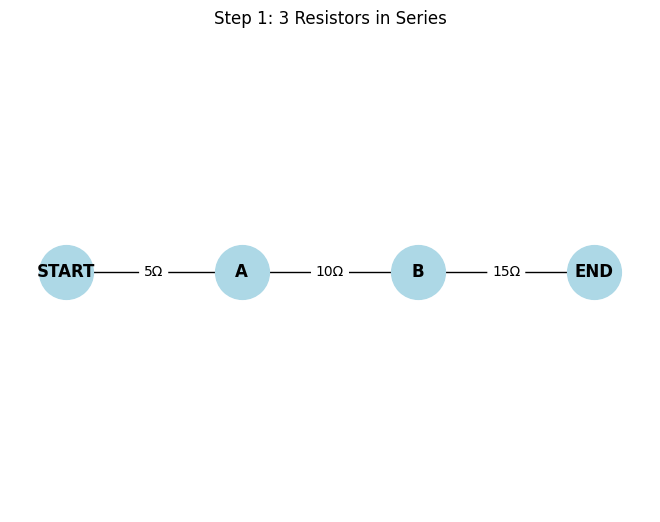
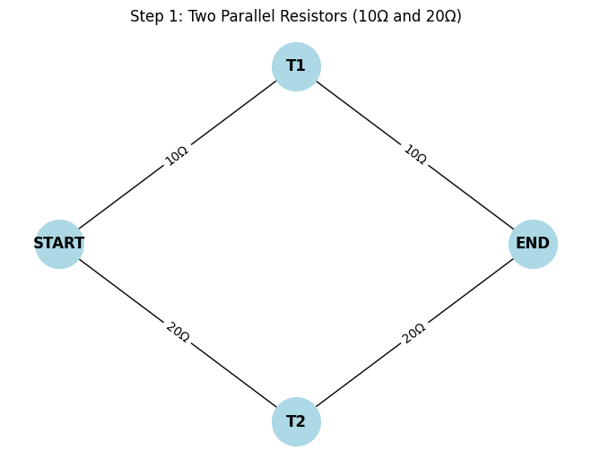

# Problem 1

##  Overview of the Solution
We'll:

1) Model the circuit as a weighted undirected graph.

2) Use graph traversal and simplification techniques to reduce the circuit iteratively:

   * Combine series resistors (linear chains).

   * Combine parallel resistors (multi-edges or cycles between the same nodes).

3) Return the final equivalent resistance between two terminals (e.g., source and sink nodes).


##  Algorithm Outline
**Key Ideas:**

* **Series Detection:** If a node has exactly 2 connections and is not a terminal, combine the two edges.

* **Parallel Detection:** Multiple edges between the same pair of nodes are reduced using the parallel resistance rule:

$$
\frac{1}{R_{eq}} = \sum_{i=1}^{n} \frac{1}{R_i}
$$

 
## 🔷 Series Resistors

All resistors are connected end-to-end. The total resistance is:

$$
𝑅eq=𝑅1+𝑅2+𝑅3+⋯+𝑅𝑛
$$
 
**Properties:**

* Current is the same through all.

* Voltage is divided across resistors.

```python
import networkx as nx
import matplotlib.pyplot as plt

def draw_series_circuit(G, step, title):
    pos = {
        "START": (0, 0),
        "A": (1, 0),
        "B": (2, 0),
        "END": (3, 0)
    }
    if "B" not in G.nodes:
        pos.pop("B")
    if "A" not in G.nodes:
        pos.pop("A")

    labels = nx.get_edge_attributes(G, 'resistance')
    nx.draw(G, pos, with_labels=True, node_size=1500, node_color="lightblue", font_weight='bold')
    nx.draw_networkx_edge_labels(G, pos, edge_labels=labels)
    plt.title(title)
    plt.axis("off")
    plt.savefig(f"series_step_{step}.png")
    plt.show()
    plt.clf()

# Step 1: Initial full series
G = nx.Graph()
G.add_edge("START", "A", resistance="5Ω")
G.add_edge("A", "B", resistance="10Ω")
G.add_edge("B", "END", resistance="15Ω")
draw_series_circuit(G, 1, "Step 1: 3 Resistors in Series")

# Step 2: Combine A-B and B-END to one 25Ω
G.remove_node("B")
G.add_edge("A", "END", resistance="25Ω")
draw_series_circuit(G, 2, "Step 2: 10Ω + 15Ω = 25Ω")

# Step 3: Combine all into 30Ω
G.remove_node("A")
G.add_edge("START", "END", resistance="30Ω")
draw_series_circuit(G, 3, "Step 3: 5Ω + 25Ω = 30Ω")
```



**The solution:**

 **Step 1 - Initial Circuit**


* Three resistors connected in series

* No simplification yet

* Expression:
5Ω + 10Ω + 15Ω

 **Step 2 – Combine 10Ω and 15Ω**

* Middle two resistors combined

* Calculation:
10Ω + 15Ω = 25Ω

 **Step 3 – Combine 5Ω and 25Ω**

* Final combination of the entire series

* Calculation:
5Ω + 25Ω = 30Ω

✅ Final Result:

$$
R_{eq} = 5\Omega + 10\Omega + 15\Omega = 30\Omega
$$


## 🔶 Parallel Resistors

**Formula:**

$$
\frac{1}{R_{eq}} = \frac{1}{R_1} + \frac{1}{R_2} + \frac{1}{R_3} + \cdots + \frac{1}{R_n}
$$
 
**Shortcut for two resistors:**

$$
R_{eq} = \frac{R_1 \cdot R_2}{R_1 + R_2}
$$


**Explanation:**

* All resistors are connected between the same two nodes.

* The voltage is the same across each resistor.

* The current splits among the parallel branches.

```python
import networkx as nx
import matplotlib.pyplot as plt

def draw_parallel_single_nodes(step, title, edges, save_name):
    pos = {
        "START": (0, 0),
        "END": (3, 0),
        "T1": (1.5, 1),
        "T2": (1.5, -1),
    }

    G = nx.Graph()
    for u, v, r in edges:
        G.add_edge(u, v, resistance=r)

    labels = nx.get_edge_attributes(G, 'resistance')
    nx.draw(G, pos, with_labels=True, node_size=1500, node_color="lightblue", font_weight='bold')
    nx.draw_networkx_edge_labels(G, pos, edge_labels=labels)
    plt.title(title)
    plt.axis("off")
    plt.savefig(save_name)
    plt.show()
    plt.clf()

# Step 1 – show two parallel resistors (10Ω and 20Ω) between START and END
edges_step1 = [
    ("START", "T1", "10Ω"),
    ("T1", "END", "10Ω"),
    ("START", "T2", "20Ω"),
    ("T2", "END", "20Ω"),
]
draw_parallel_single_nodes(1, "Step 1: Two Parallel Resistors (10Ω and 20Ω)", edges_step1, "parallel_step1.png")

# Step 2 – replace with a single equivalent resistor (6.67Ω)
edges_step2 = [
    ("START", "END", "6.67Ω"),
]
draw_parallel_single_nodes(2, "Step 2: Equivalent Resistance = 6.67Ω", edges_step2, "parallel_step2.png")

```





**The solution:**

Step 1:

Two separate paths:
START → T1 → END (10Ω)
START → T2 → END (20Ω)

Clearly visible top and bottom resistors

Step 2:

A single edge: START → END with 6.67Ω

$$
R_{eq} = \frac{1}{\frac{1}{10} + \frac{1}{20}} = 6.7\Omega
$$

## Efficiency & Improvements

**Complexity:**

* **Parallel reduction:** O(E) per iteration

* **Series detection:** O(N) per iteration

* **Total iterations:** ≤ N (number of nodes)

**Improvements:**

* Use union-find to track components.

* Optimize detection of series/parallel structures with pattern matching.

* Integrate Kirchhoff’s laws + Laplacian matrix method (graph-theoretic method using Y-Δ transforms and node-voltage analysis).

## Final Thoughts
This approach is **systematic and generalizable**. It:

* Uses graph theory to model physical systems.

* Supports automation and scalability for complex networks.

* Bridges mathematical theory and engineering practice.


## Colab

[click to go colab](https://colab.research.google.com/drive/1vy_Iklm1AUIEgzHl_PPTnKtVMbs_9GzY?usp=sharing)