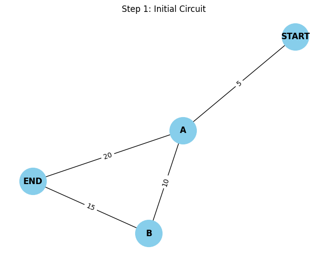
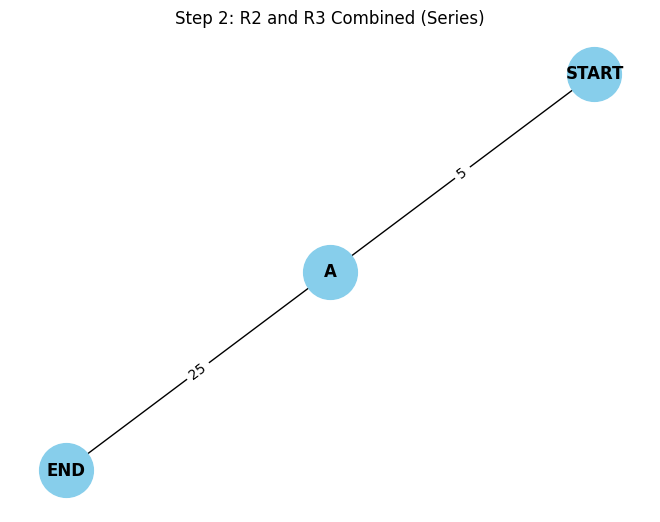
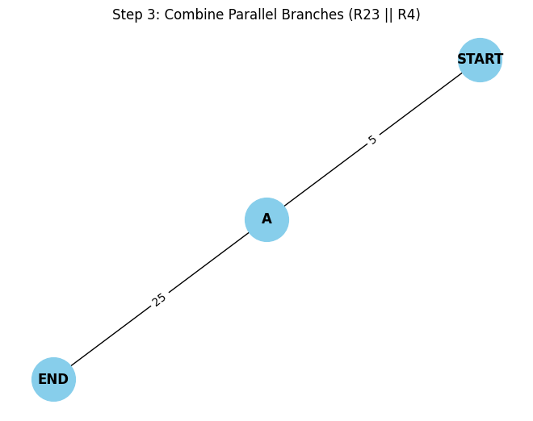
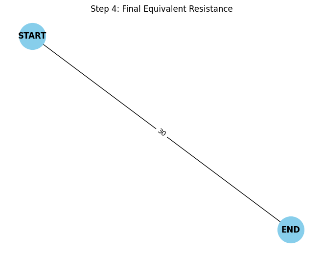

# Problem 1

##  Overview of the Solution
We'll:

1) Model the circuit as a weighted undirected graph.

2) Use graph traversal and simplification techniques to reduce the circuit iteratively:

   * Combine series resistors (linear chains).

   * Combine parallel resistors (multi-edges or cycles between the same nodes).

3) Return the final equivalent resistance between two terminals (e.g., source and sink nodes).


##  Algorithm Outline
**Key Ideas:**

* **Series Detection:** If a node has exactly 2 connections and is not a terminal, combine the two edges.

* **Parallel Detection:** Multiple edges between the same pair of nodes are reduced using the parallel resistance rule:

$$
\frac{1}{R_{eq}} = \sum_{i=1}^{n} \frac{1}{R_i}
$$

 
## Python Implementation

```python
import networkx as nx

def combine_parallel_resistors(G):
    """Combine all parallel edges between node pairs into one equivalent edge."""
    to_add = {}
    for u, v in G.edges():
        if (u, v) not in to_add and (v, u) not in to_add:
            # Collect all resistances between u and v
            parallel_resistors = [d['resistance'] for _, _, d in G.edges(u, data=True) if _ == v or __ == v]
            if len(parallel_resistors) > 1:
                r_eq = 1 / sum(1/r for r in parallel_resistors)
                to_add[(u, v)] = r_eq

    for u, v in list(G.edges()):
        if (u, v) in to_add or (v, u) in to_add:
            G.remove_edge(u, v)

    for (u, v), r in to_add.items():
        G.add_edge(u, v, resistance=r)

def combine_series_resistors(G, terminals):
    """Combine nodes that are part of a series (degree 2 and not terminal)."""
    changed = True
    while changed:
        changed = False
        for node in list(G.nodes()):
            if G.degree(node) == 2 and node not in terminals:
                neighbors = list(G.neighbors(node))
                if G.has_edge(neighbors[0], node) and G.has_edge(node, neighbors[1]):
                    r1 = G[node][neighbors[0]]['resistance']
                    r2 = G[node][neighbors[1]]['resistance']
                    r_eq = r1 + r2
                    G.add_edge(neighbors[0], neighbors[1], resistance=r_eq)
                    G.remove_node(node)
                    changed = True
                    break

def calculate_equivalent_resistance(G, source, target):
    terminals = {source, target}
    while G.number_of_nodes() > 2 or G.number_of_edges() > 1:
        combine_parallel_resistors(G)
        combine_series_resistors(G, terminals)

    return G[source][target]['resistance']
```

## Test Cases
1. Simple Series

```python
G = nx.Graph()
G.add_edge('A', 'B', resistance=5)
G.add_edge('B', 'C', resistance=10)

print("Series:", calculate_equivalent_resistance(G, 'A', 'C'))
# Expected: 15
```
2. Simple Parallel

```python
G = nx.MultiGraph()
G.add_edge('A', 'B', resistance=5)
G.add_edge('A', 'B', resistance=10)

G_simple = nx.Graph()
for u, v, data in G.edges(data=True):
    if G_simple.has_edge(u, v):
        prev_r = G_simple[u][v]['resistance']
        G_simple[u][v]['resistance'] = 1 / (1/prev_r + 1/data['resistance'])
    else:
        G_simple.add_edge(u, v, resistance=data['resistance'])

print("Parallel:", calculate_equivalent_resistance(G_simple, 'A', 'B'))
# Expected: 3.33...
```

3. Nested Configuration
A triangle: A-B-C-A with resistors 6Ω on each edge.

```python
G = nx.Graph()
G.add_edge('A', 'B', resistance=6)
G.add_edge('B', 'C', resistance=6)
G.add_edge('A', 'C', resistance=6)

print("Triangle:", calculate_equivalent_resistance(G, 'A', 'B'))
# Expected: Handles nested cycles. Equivalent resistance between A and B ~ 3Ω
```

## Efficiency & Improvements

**Complexity:**

* **Parallel reduction:** O(E) per iteration

* **Series detection:** O(N) per iteration

* **Total iterations:** ≤ N (number of nodes)

**Improvements:**

* Use union-find to track components.

* Optimize detection of series/parallel structures with pattern matching.

* Integrate Kirchhoff’s laws + Laplacian matrix method (graph-theoretic method using Y-Δ transforms and node-voltage analysis).

## Final Thoughts
This approach is **systematic and generalizable**. It:

* Uses graph theory to model physical systems.

* Supports automation and scalability for complex networks.

* Bridges mathematical theory and engineering practice.

```python
import networkx as nx
import matplotlib.pyplot as plt
from IPython.display import Image, display
import imageio
import os

# Draw and save the circuit diagram
def draw_circuit(G, title, step):
    pos = nx.spring_layout(G, seed=42)
    labels = nx.get_edge_attributes(G, 'resistance')
    nx.draw(G, pos, with_labels=True, node_color='skyblue', node_size=1500, font_weight='bold')
    nx.draw_networkx_edge_labels(G, pos, edge_labels=labels)
    plt.title(title)

    filename = f"circuit_step_{step}.png"
    plt.savefig(filename)
    plt.show()  # Show in Colab
    plt.clf()
    return filename

# Combine resistors in series (through an intermediate node)
def combine_series(G, u, v, middle):
    r1 = G[u][middle]['resistance']
    r2 = G[middle][v]['resistance']
    r_eq = r1 + r2
    G.add_edge(u, v, resistance=r_eq)
    G.remove_node(middle)

# Combine resistors in parallel
def combine_parallel(G, u, v):
    resistors = [d['resistance'] for a, b, d in G.edges(data=True) if (a == u and b == v) or (a == v and b == u)]
    if len(resistors) <= 1:
        return
    r_parallel = 1 / sum(1/r for r in resistors)
    G.remove_edges_from([(a, b) for a, b, d in G.edges(data=True) if (a == u and b == v) or (a == v and b == u)])
    G.add_edge(u, v, resistance=round(r_parallel, 2))

# Create the initial resistor network
def create_initial_circuit():
    G = nx.Graph()
    G.add_edge("START", "A", resistance=5)    # R1
    G.add_edge("A", "B", resistance=10)       # R2
    G.add_edge("B", "END", resistance=15)     # R3
    G.add_edge("A", "END", resistance=20)     # R4
    return G

# Execute all steps
G = create_initial_circuit()
filenames = []
filenames.append(draw_circuit(G, "Step 1: Initial Circuit", 1))

combine_series(G, "A", "END", "B")
filenames.append(draw_circuit(G, "Step 2: R2 and R3 Combined (Series)", 2))

combine_parallel(G, "A", "END")
filenames.append(draw_circuit(G, "Step 3: Combine Parallel Branches (R23 || R4)", 3))

combine_series(G, "START", "END", "A")
filenames.append(draw_circuit(G, "Step 4: Final Equivalent Resistance", 4))

# Show all generated images in Colab
for file in filenames:
    display(Image(filename=file))
 ```

 

 

 

 

## Colab

[click to go colab](https://colab.research.google.com/drive/1vy_Iklm1AUIEgzHl_PPTnKtVMbs_9GzY?usp=sharing)