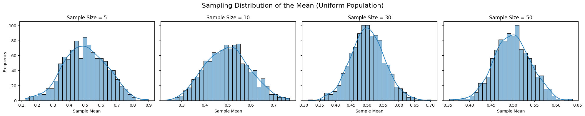
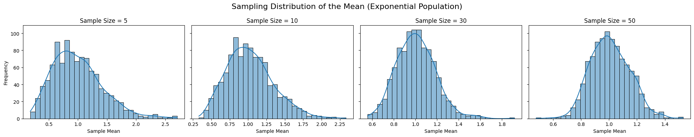
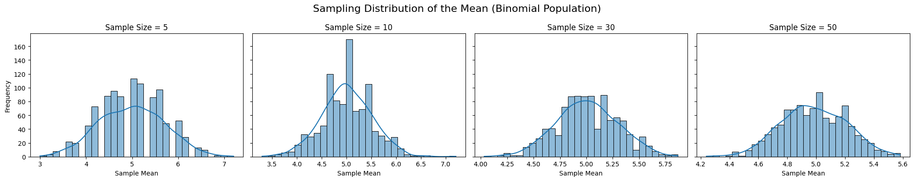

# Problem 1

## 📘 Central Limit Theorem – Simulation Study

### 🎯 Objective

The goal of this project is to demonstrate the Central Limit Theorem (CLT) by simulating sampling distributions of the mean from different population distributions and observing how these distributions approach normality as the sample size increases.

## 📦 Population Distributions
We will use the following three population types:

• Uniform Distribution: Evenly distributed between 0 and 1.

• Exponential Distribution: Skewed, right-tailed distribution.

• Binomial Distribution: Discrete distribution with n = 10, p = 0.5.

## 🔧 Sampling Settings

```python
import numpy as np
import matplotlib.pyplot as plt
import seaborn as sns

# Set constants
np.random.seed(42)
POPULATION_SIZE = 100000
sample_sizes = [5, 10, 30, 50]
n_samples = 1000
```

## 📊 1. Uniform Distribution — Sampling Distribution of the Mean

```python
# Create uniform population
uniform_population = np.random.uniform(0, 1, POPULATION_SIZE)

# Plotting
fig, axes = plt.subplots(1, len(sample_sizes), figsize=(20, 4), sharey=True)
fig.suptitle('Sampling Distribution of the Mean (Uniform Population)', fontsize=16)

for i, n in enumerate(sample_sizes):
    sample_means = [np.mean(np.random.choice(uniform_population, size=n, replace=False)) for _ in range(n_samples)]
    sns.histplot(sample_means, kde=True, ax=axes[i], bins=30)
    axes[i].set_title(f'Sample Size = {n}')
    axes[i].set_xlabel('Sample Mean')
    axes[i].set_ylabel('Frequency')

plt.tight_layout()
plt.show()
```



## 📊 2. Exponential Distribution — Sampling Distribution of the Mean

```python
# Create exponential population
exponential_population = np.random.exponential(scale=1, size=POPULATION_SIZE)

# Plotting
fig, axes = plt.subplots(1, len(sample_sizes), figsize=(20, 4), sharey=True)
fig.suptitle('Sampling Distribution of the Mean (Exponential Population)', fontsize=16)

for i, n in enumerate(sample_sizes):
    sample_means = [np.mean(np.random.choice(exponential_population, size=n, replace=False)) for _ in range(n_samples)]
    sns.histplot(sample_means, kde=True, ax=axes[i], bins=30)
    axes[i].set_title(f'Sample Size = {n}')
    axes[i].set_xlabel('Sample Mean')
    axes[i].set_ylabel('Frequency')

plt.tight_layout()
plt.show()
```




## 📊 3. Binomial Distribution — Sampling Distribution of the Mean

```python
# Create binomial population
binomial_population = np.random.binomial(n=10, p=0.5, size=POPULATION_SIZE)

# Plotting
fig, axes = plt.subplots(1, len(sample_sizes), figsize=(20, 4), sharey=True)
fig.suptitle('Sampling Distribution of the Mean (Binomial Population)', fontsize=16)

for i, n in enumerate(sample_sizes):
    sample_means = [np.mean(np.random.choice(binomial_population, size=n, replace=False)) for _ in range(n_samples)]
    sns.histplot(sample_means, kde=True, ax=axes[i], bins=30)
    axes[i].set_title(f'Sample Size = {n}')
    axes[i].set_xlabel('Sample Mean')
    axes[i].set_ylabel('Frequency')

plt.tight_layout()
plt.show()
```



## 📐 Theoretical Insight: Variance and Spread

```python
# Display variance of each population
print("Population Variances:")
print(f"Uniform: {np.var(uniform_population):.4f}")
print(f"Exponential: {np.var(exponential_population):.4f}")
print(f"Binomial: {np.var(binomial_population):.4f}")
```
As per CLT, the standard deviation of the sampling distribution (called the standard error) is:

$$
\sigma_{\bar{x}} = \frac{\sigma}{\sqrt{n}}
$$ 

So, as the sample size increases, the spread of the sampling distribution decreases.

## 🌍  Practical Applications of CLT

The Central Limit Theorem plays a crucial role in:

### ✅ Estimating Population Parameters

• Use sample means to estimate the unknown population mean with confidence intervals.

### 🏭 Quality Control

• CLT ensures that even with non-normal production data, control charts (based on sample means) follow normality.

### 💰 Financial Forecasting

 • Portfolio returns often aggregate many random variables; CLT supports assuming normality of average returns.

