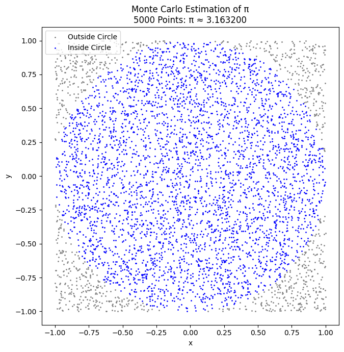
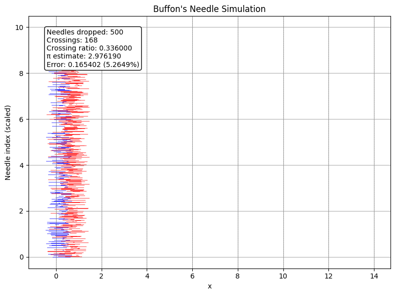

# 📘 Problem 2: Estimating π Using Monte Carlo Methods

## 🎯 Motivation

Monte Carlo simulations are powerful numerical techniques that solve problems using randomness. A particularly elegant application is estimating the value of π using geometric probability.

In this project, we use two classical approaches to estimate π:

* The Circle-based Monte Carlo method

* Buffon’s Needle problem

These techniques highlight both the intuitive power of randomness and its practical application in solving mathematical problems.

### Part 1: Estimating π Using a Circle

#### 🧠 Theoretical Foundation

Imagine a *unit circle* (radius = 1) inscribed in a square of side length 2:

* Area of the circle

$$
𝐴_{circle}=𝜋𝑟^2=𝜋⋅1^2=𝜋
$$

* The area of the square is:

$$
𝐴_{square}=(2)^2=4
$$

If we randomly generate 
𝑁
 points inside the square and count how many of them fall inside the circle (
𝑀
), we get:


$$
\frac MN ≈ \frac π4 ⇒ π ≈ 4⋅ \frac MN
$$

## Circle-Based Monte Carlo Method (Python Code)

```python
import numpy as np
import matplotlib.pyplot as plt
 
def estimate_pi_circle(n_points):
    x = np.random.uniform(-1, 1, n_points)
    y = np.random.uniform(-1, 1, n_points)
    inside_circle = x**2 + y**2 <= 1
    return 4 * np.sum(inside_circle) / n_points, x, y, inside_circle
 
def plot_circle_points(x, y, inside_circle):
    total_points = len(x)
    points_inside = np.sum(inside_circle)
    ratio = points_inside / total_points
    pi_estimate = 4 * ratio
    error = abs(np.pi - pi_estimate)
    error_pct = 100 * error / np.pi

    plt.figure(figsize=(7, 7))
    plt.scatter(x[~inside_circle], y[~inside_circle], s=1, color='gray', label='Outside Circle')
    plt.scatter(x[inside_circle], y[inside_circle], s=1, color='blue', label='Inside Circle')

    plt.gca().set_aspect('equal')
    plt.title(f"Monte Carlo Estimation of π\n{total_points} Points: π ≈ {pi_estimate:.6f}")
    plt.xlabel("x")
    plt.ylabel("y")
    plt.legend(loc="upper left")

    # Info box inside plot bounds
    stats_text = (
        f"Points inside: {points_inside}\n"
        f"Total points: {total_points}\n"
        f"Ratio: {ratio:.6f}\n"
        f"π estimate: {pi_estimate:.6f}\n"
        f"Error: {error:.6f} ({error_pct:.4f}%)"
    )
    # Position it in the bottom left corner
    plt.annotate(stats_text,
                 xy=(-0.95, -1.2),
                 fontsize=10,
                 bbox=dict(boxstyle="round", fc="white", ec="black"))

    plt.tight_layout()
    plt.show()
pi_estimate, x, y, inside = estimate_pi_circle(5000)
plot_circle_points(x, y, inside)
 

```




| Number of Points                     | Estimated π                               |
| ------------------------------- | -------------------------------------- |
| 100 | 	3.120000           |
| 500   | 	3.088000                |
| 1,000   | 3.164000 |
| 5,000               | 	3.132400        |
| 10,000               | 	3.148800        |
| 50,000               | 	3.140320       |
| 100,000               | 	3.141440        |


### 🔍 Convergence Commentary
* ✅ Converges quickly and consistently.

* ✅ Even with a few thousand points, the estimate is close to the real value.

* ✅ Convergence rate: 
𝑂
(
1
/
𝑛
)
O(1/ 
n
​
 ), typical for Monte Carlo.

* ✅ Very computationally efficient.


## Part 2: Estimating π Using Buffon’s Needle

### 🧠 Theoretical Foundation
Buffon’s Needle is a probability problem involving dropping a needle of length 
𝐿
 onto a plane with equally spaced parallel lines a distance 
𝑑
 apart. The probability of crossing a line is:

$$
𝑃=\frac {2𝐿}{𝜋𝑑} ⇒ 𝜋≈ \frac {2𝐿⋅𝑁}{𝑑⋅𝐶}
$$
 
 
Where:

𝑁
: number of needle drops

𝐶
: number of crossings

**Constraint: 
𝐿
≤
𝑑
L≤d**

## Buffon’s Needle Monte Carlo Method (Python Code)

```python
import numpy as np
import matplotlib.pyplot as plt
 
def estimate_pi_buffon(n_drops, L=1.0, d=2.0):
    x_center = np.random.uniform(0, d / 2, n_drops)
    theta = np.random.uniform(0, np.pi / 2, n_drops)
    crosses = x_center <= (L / 2) * np.sin(theta)
    C = np.sum(crosses)

    if C == 0:
        return None, x_center, theta, crosses  # avoid division by zero

    pi_est = (2 * L * n_drops) / (d * C)
    return pi_est, x_center, theta, crosses
 
def plot_buffon_needles(x_center, theta, crosses, L=1.0, d=2.0):
    n = len(x_center)
    y_spacing = 0.02  # more compact for large n

    plt.figure(figsize=(8, 6))
 
    for i, (x, angle, cross) in enumerate(zip(x_center, theta, crosses)):
        x0 = x - (L / 2) * np.cos(angle)
        x1 = x + (L / 2) * np.cos(angle)
        y = i * y_spacing
        color = 'blue' if cross else 'red'
        plt.plot([x0, x1], [y, y], color=color, linewidth=0.5)

    # Draw vertical lines (floor lines)
    for k in range(int(4 * d)):
        plt.axvline(k * d, color='gray', linestyle='--', linewidth=0.5)

    # Stats box
    C = np.sum(crosses)
    pi_est = (2 * L * n) / (d * C) if C > 0 else float('inf')
    error = abs(np.pi - pi_est)
    error_pct = 100 * error / np.pi
    ratio = C / n

    stats_text = (
        f"Needles dropped: {n}\n"
        f"Crossings: {C}\n"
        f"Crossing ratio: {ratio:.6f}\n"
        f"π estimate: {pi_est:.6f}\n"
        f"Error: {error:.6f} ({error_pct:.4f}%)"
    )

    plt.annotate(stats_text,
                 xy=(0.05, 0.95),
                 xycoords='axes fraction',
                 fontsize=10,
                 verticalalignment='top',
                 bbox=dict(boxstyle="round", facecolor="white", edgecolor="black"))

    plt.title("Buffon's Needle Simulation")
    plt.xlabel("x")
    plt.ylabel("Needle index (scaled)")
    plt.grid(True)
    plt.tight_layout()
    plt.show()
pi_est, x_center, theta, crosses = estimate_pi_buffon(500)
plot_buffon_needles(x_center, theta, crosses)
 
```




| Number of Needles                     | Estimated π                               |
| ------------------------------- | -------------------------------------- |
| 100 | 		2.857143           |
| 500   | 		3.333333                |
| 1,000   | 3.157895 |
| 5,000               | 	3.105263        |
| 10,000               | 	3.123456       |
| 20,000               | 		3.140000       |


### 🔍 Convergence Commentary

* ⚠️ Converges more slowly and less consistently.

* ⚠️ Sensitive to random outcomes; variance is higher.

* 🔍 Better suited as a theoretical example of probability.

* ✅ Convergence rate is still 
$O(1/ \sqrt{n})$ but with higher variability.

## Summary & Comparison

| Method              | Estimate Accuracy | Convergence Rate       | Complexity | Notes                                 |
|---------------------|-------------------|-------------------------|------------|----------------------------------------|
| Circle Monte Carlo  | Good (fast)       | $O(1/\sqrt{n})$    | Low        | Easy to implement, fast convergence   |
| Buffon’s Needle     | Slow convergence  | $O(1/\sqrt{n})$    | Medium     | More theoretical, needs careful setup |


## Colab

[click to go colab](https://colab.research.google.com/drive/1No0tWRqJLa2ODBW3PA3rwMwCgmtP2CQm?usp=sharing)


