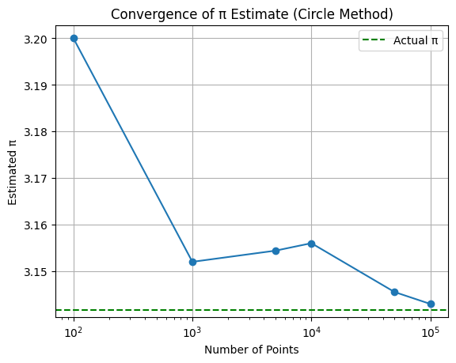

# Problem 2

# 📘 Estimating π Using Monte Carlo Methods

## Part 1: Estimating π Using a Circle
### 1. Theoretical Foundation

**To estimate π using geometry:**

* Consider a unit circle (radius = 1) inscribed in a square of side length 2.

* The area of the circle is:

$$
𝐴_{circle}=𝜋𝑟^2=𝜋⋅1^2=𝜋
$$

* The area of the square is:

$$
𝐴_{square}=(2)^2=4
$$


The ratio of the area of the circle to the square is:

$$
\frac {𝐴_{circle}} {𝐴_{square}}=\frac 𝜋4
$$
 

So, if we randomly generate 
𝑁
N points within the square and count how many 
𝑀
M fall inside the circle, we estimate π as:

$$
𝜋≈4⋅ \frac 𝑀𝑁
$$

## 2. Simulation (Python Code)
```python
Düzenle
import numpy as np
import matplotlib.pyplot as plt

def estimate_pi_circle(num_points):
    x = np.random.uniform(-1, 1, num_points)
    y = np.random.uniform(-1, 1, num_points)
    inside_circle = x**2 + y**2 <= 1
    pi_estimate = 4 * np.sum(inside_circle) / num_points
    return pi_estimate, x, y, inside_circle
```
## 3. Visualization

```python
def plot_circle_simulation(x, y, inside_circle):
    plt.figure(figsize=(6, 6))
    plt.scatter(x[inside_circle], y[inside_circle], color='blue', s=1, label='Inside Circle')
    plt.scatter(x[~inside_circle], y[~inside_circle], color='red', s=1, label='Outside Circle')
    plt.gca().set_aspect('equal')
    plt.title("Monte Carlo Estimation of π (Circle Method)")
    plt.legend()
    plt.show()
```
## 4. Analysis

```python
import matplotlib.pyplot as plt

sample_sizes = [100, 1000, 5000, 10000, 50000, 100000]
estimates = []

for size in sample_sizes:
    pi, _, _, _ = estimate_pi_circle(size)
    estimates.append(pi)

plt.plot(sample_sizes, estimates, marker='o')
plt.axhline(np.pi, color='green', linestyle='--', label='Actual π')
plt.title("Convergence of π Estimate (Circle Method)")
plt.xlabel("Number of Points")
plt.ylabel("Estimated π")
plt.legend()
plt.xscale('log')
plt.grid(True)
plt.show()
```



## Part 2: Estimating π Using Buffon’s Needle

### 1. Theoretical Foundation

Buffon's Needle Problem: Drop a needle of length 
𝐿
L onto a floor with parallel lines spaced 
𝑑
d apart (where 
𝐿
≤
𝑑
L≤d).

The probability that the needle crosses a line is:

$$
𝑃=\frac {2𝐿}{𝜋𝑑}
$$
 
Solving for π gives:

$$
𝜋≈ \frac {2𝐿⋅𝑁}{𝑑⋅𝐶}
$$
 
where:

* 𝑁
= number of drops

* 𝐶
 = number of crossings

## Summary & Comparison

| Method              | Estimate Accuracy | Convergence Rate       | Complexity | Notes                                 |
|---------------------|-------------------|-------------------------|------------|----------------------------------------|
| Circle Monte Carlo  | Good (fast)       | $O(1/\sqrt{n})$    | Low        | Easy to implement, fast convergence   |
| Buffon’s Needle     | Slow convergence  | $O(1/\sqrt{n})$    | Medium     | More theoretical, needs careful setup |
