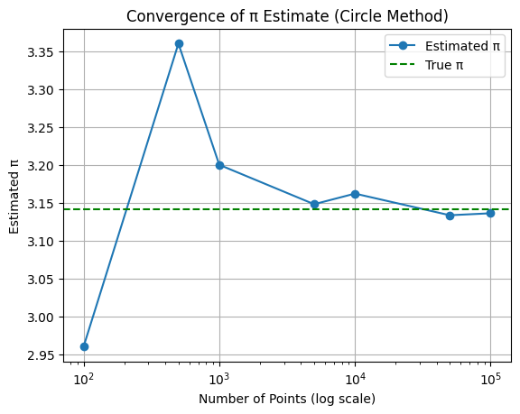
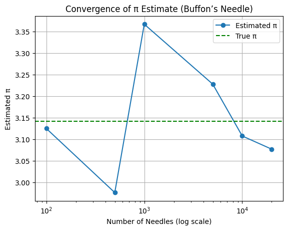

# 📘 Problem 2: Estimating π Using Monte Carlo Methods

## 🎯 Motivation

Monte Carlo simulations are powerful numerical techniques that solve problems using randomness. A particularly elegant application is estimating the value of π using geometric probability.

In this project, we use two classical approaches to estimate π:

* The Circle-based Monte Carlo method

* Buffon’s Needle problem

These techniques highlight both the intuitive power of randomness and its practical application in solving mathematical problems.

### Part 1: Estimating π Using a Circle

#### 🧠 Theoretical Foundation

Imagine a *unit circle* (radius = 1) inscribed in a square of side length 2:

* Area of the circle

$$
𝐴_{circle}=𝜋𝑟^2=𝜋⋅1^2=𝜋
$$

* The area of the square is:

$$
𝐴_{square}=(2)^2=4
$$

If we randomly generate 
𝑁
 points inside the square and count how many of them fall inside the circle (
𝑀
), we get:


$$
\frac MN ≈ \frac π4 ⇒ π ≈ 4⋅ \frac MN
$$

 

### 💻 Simulation Code (Python)

 ```python
import numpy as np
import matplotlib.pyplot as plt

def estimate_pi_circle(n_points):
    x = np.random.uniform(-1, 1, n_points)
    y = np.random.uniform(-1, 1, n_points)
    inside = x**2 + y**2 <= 1
    pi_est = 4 * np.sum(inside) / n_points
    return pi_est, x, y, inside
```
### 📊 Visualization
```python
def plot_circle_points(x, y, inside):
    plt.figure(figsize=(6, 6))
    plt.scatter(x[inside], y[inside], s=1, color='blue', label='Inside Circle')
    plt.scatter(x[~inside], y[~inside], s=1, color='red', label='Outside Circle')
    plt.gca().set_aspect('equal')
    plt.title("Monte Carlo Circle Method for π")
    plt.xlabel("x")
    plt.ylabel("y")
    plt.legend()
    plt.grid(True)
    plt.show()
 ```
### 📈 Convergence Analysis
```python
 
sample_sizes = [100, 500, 1000, 5000, 10000, 50000, 100000]
estimates = []

for n in sample_sizes:
    pi, *_ = estimate_pi_circle(n)
    estimates.append(pi)

plt.plot(sample_sizes, estimates, marker='o', label='Estimated π')
plt.axhline(np.pi, color='green', linestyle='--', label='True π')
plt.xscale('log')
plt.xlabel("Number of Points (log scale)")
plt.ylabel("Estimated π")
plt.title("Convergence of π Estimate (Circle Method)")
 plt.legend()
 plt.grid(True)
 plt.show()
```



### 🔍 Convergence Commentary
* ✅ Converges quickly and consistently.

* ✅ Even with a few thousand points, the estimate is close to the real value.

* ✅ Convergence rate: 
𝑂
(
1
/
𝑛
)
O(1/ 
n
​
 ), typical for Monte Carlo.

* ✅ Very computationally efficient.


## Part 2: Estimating π Using Buffon’s Needle

### 🧠 Theoretical Foundation
Buffon’s Needle is a probability problem involving dropping a needle of length 
𝐿
 onto a plane with equally spaced parallel lines a distance 
𝑑
 apart. The probability of crossing a line is:

$$
𝑃=\frac {2𝐿}{𝜋𝑑} ⇒ 𝜋≈ \frac {2𝐿⋅𝑁}{𝑑⋅𝐶}
$$
 
 
Where:

𝑁
: number of needle drops

𝐶
: number of crossings

**Constraint: 
𝐿
≤
𝑑
L≤d**

### 💻 Simulation Code (Python)

```python
def estimate_pi_buffon(n_drops, L=1.0, d=2.0):
    x_center = np.random.uniform(0, d/2, n_drops)
    theta = np.random.uniform(0, np.pi/2, n_drops)
    crosses = x_center <= (L/2) * np.sin(theta)
    C = np.sum(crosses)
    if C == 0:
        return None, x_center, theta, crosses
    pi_est = (2 * L * n_drops) / (d * C)
    return pi_est, x_center, theta, crosses
```

### 📊 Visualization

```python
def plot_buffon_needles(x_center, theta, crosses, L=1.0, d=2.0):
    plt.figure(figsize=(8, 6))
    for i, (x, angle, cross) in enumerate(zip(x_center, theta, crosses)):
        x0 = x - (L/2) * np.cos(angle)
        x1 = x + (L/2) * np.cos(angle)
        y = i * 0.05
        color = 'blue' if cross else 'red'
        plt.plot([x0, x1], [y, y], color=color, linewidth=0.5)
    for i in range(5):
        plt.axvline(i * d, color='gray', linestyle='--')
    plt.title("Buffon's Needle Simulation")
    plt.xlabel("x")
    plt.ylabel("Needle Drops")
    plt.grid(True)
    plt.show()
```

### 📈 Convergence Analysis

```python
sample_sizes = [100, 500, 1000, 5000, 10000, 20000]
buffon_estimates = []

for n in sample_sizes:
    pi, *_ = estimate_pi_buffon(n)
    buffon_estimates.append(pi if pi else np.nan)

plt.plot(sample_sizes, buffon_estimates, marker='o', label="Estimated π")
plt.axhline(np.pi, color='green', linestyle='--', label="True π")
plt.xscale('log')
plt.xlabel("Number of Needles (log scale)")
plt.ylabel("Estimated π")
plt.title("Convergence of π Estimate (Buffon’s Needle)")
plt.legend()
plt.grid(True)
plt.show()
```



### 🔍 Convergence Commentary

* ⚠️ Converges more slowly and less consistently.

* ⚠️ Sensitive to random outcomes; variance is higher.

* 🔍 Better suited as a theoretical example of probability.

* ✅ Convergence rate is still 
$O(1/ \sqrt{n})$ but with higher variability.

## Summary & Comparison

| Method              | Estimate Accuracy | Convergence Rate       | Complexity | Notes                                 |
|---------------------|-------------------|-------------------------|------------|----------------------------------------|
| Circle Monte Carlo  | Good (fast)       | $O(1/\sqrt{n})$    | Low        | Easy to implement, fast convergence   |
| Buffon’s Needle     | Slow convergence  | $O(1/\sqrt{n})$    | Medium     | More theoretical, needs careful setup |


## Colab

[click to go colab](https://colab.research.google.com/drive/1No0tWRqJLa2ODBW3PA3rwMwCgmtP2CQm?usp=sharing)